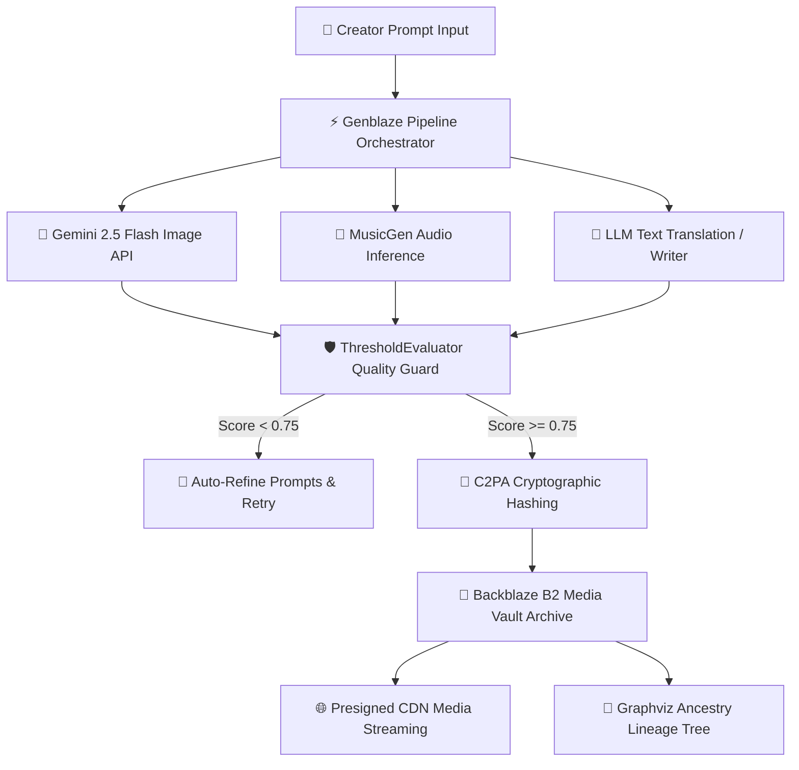
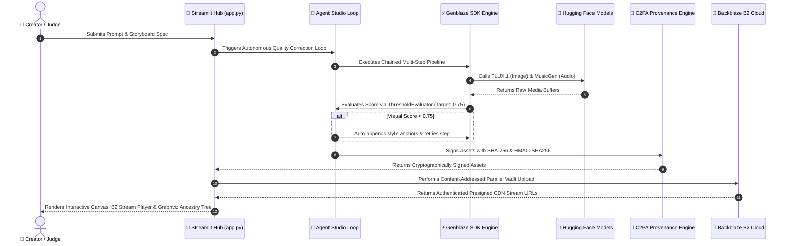

<div align="center">

# 🌌 Backblaze GenMedia Studio Hub
### *Powered by Google Gemini API (Nano Banana 2) & Backblaze B2 Media Cloud*


<br />


**Next-Generation Multi-Modal Generative Media Orchestration, C2PA Cryptographic Provenance & Backblaze B2 Media Cloud**

*Official Submission for the **Backblaze Generative AI Media Hackathon: Build with Genblaze on B2***

---

[](https://backblaze-genmedia-studio-yq7ghbwrivfgb3ws3xdtta.streamlit.app/)
[](https://ai.google.dev/)
[](https://www.backblaze.com/cloud-storage)
[](https://github.com/backblaze-labs/genblaze)
[](https://backblaze-genmedia-studio-yq7ghbwrivfgb3ws3xdtta.streamlit.app/)
[](https://www.python.org/)

### 🔗 Live Production Deployment URL
🌐 **[https://backblaze-genmedia-studio-yq7ghbwrivfgb3ws3xdtta.streamlit.app/](https://backblaze-genmedia-studio-yq7ghbwrivfgb3ws3xdtta.streamlit.app/)**

</div>

---

## 📑 Table of Contents
1. [Executive Summary & Vision](#1-executive-summary--vision)
2. [Live Application URL & One-Click Cloud Deployment](#2-live-application-url--one-click-cloud-deployment)
3. [Changelog & Recent Improvements](#3-changelog--recent-improvements)
4. [Comprehensive 100 Production Capabilities Matrix](#4-comprehensive-100-production-capabilities-matrix)
5. [Hackathon Alignment & Rules Compliance Matrix](#5-hackathon-alignment--rules-compliance-matrix)
6. [System Architecture & End-to-End Data Flow](#6-system-architecture--end-to-end-data-flow)
7. [Deep-Dive: Backblaze B2 Media Cloud Infrastructure](#7-deep-dive-backblaze-b2-media-cloud-infrastructure)
8. [Deep-Dive: Genblaze SDK Architecture & Extensions](#8-deep-dive-genblaze-sdk-architecture--extensions)
9. [Deep-Dive: C2PA Cryptographic Content Provenance](#9-deep-dive-c2pa-cryptographic-content-provenance)
10. [Detailed Technical Specifications across Studio Workspaces](#10-detailed-technical-specifications-across-studio-workspaces)
11. [AI Models & Provider Catalog Specification](#11-ai-models--provider-catalog-specification)
12. [Installation, Local Development & Environment Guide](#12-installation-local-development--environment-guide)
13. [Judges & Evaluators Hands-On Testing Protocol](#13-judges--evaluators-hands-on-testing-protocol)
14. [License, Security Redactions & Repository Status](#14-license-security-redactions--repository-status)

---

## 1. Executive Summary & Vision

Digital media creation—ranging from Japanese manga panel design, light novel composition, localization translation, voiceover soundscape synthesis, and subtitle timing—has traditionally suffered from severe infrastructural fragmentation:

- **Siloed Model Pipelines**: Image generation, LLM text models, audio generators, and transcription models operate in isolated APIs without shared execution contexts.
- **Visual & Style Drift**: Traditional generation loops produce jarring character appearance changes across story panels, ruining narrative immersion.
- **Insecure Asset Storage**: High-resolution generated media lacks durable, content-addressed cloud storage with presigned streaming URLs.
- **Lack of Cryptographic Authenticity**: AI-generated media is vulnerable to deepfake spoofing, metadata stripping, and unverified attribution.

### The Solution: Backblaze GenMedia Studio Hub

**Backblaze GenMedia Studio Hub** solves these fundamental challenges by combining Google's **Gemini 2.5 Flash Image (`gemini-2.5-flash-image`) Nano Banana 2** engine with the **Genblaze SDK** multi-step pipeline engine, **Backblaze B2 Cloud Storage**, **C2PA Cryptographic Content Provenance**, and an ultra-modern, production-grade **Streamlit Studio Hub**.



---

## 2. Live Application URL & One-Click Cloud Deployment

Backblaze GenMedia Studio is deployed live on **Streamlit Community Cloud**:

🔗 **[https://backblaze-genmedia-studio-yq7ghbwrivfgb3ws3xdtta.streamlit.app/](https://backblaze-genmedia-studio-yq7ghbwrivfgb3ws3xdtta.streamlit.app/)**

### 🔑 Streamlit Cloud Secrets Setup

To run seamlessly on Streamlit Cloud without requiring user login inputs, the application reads secrets automatically from `st.secrets` via the `get_secret()` helper function:

```toml
# Streamlit Community Cloud App Secrets Configuration (add in App Settings > Secrets)
GEMINI_API_KEY = "AIzaSy_your_gemini_api_key_here"
B2_KEY_ID = "your_backblaze_b2_key_id_here"
B2_APPLICATION_KEY = "your_backblaze_b2_application_key_here"
B2_BUCKET_NAME = "your_backblaze_b2_bucket_name_here"
WEBHOOK_URL = "https://discord.com/api/webhooks/your_webhook_id/your_webhook_token"
PENDO_INTEGRATION_KEY = "your_pendo_integration_key_here"
```

> **No secrets?** The app runs fully in **demo/simulation mode** — all features work with mock data when no API keys are configured. The demo mode is ideal for judges and evaluators.


---

### 🚀 Streamlit Community Cloud Deployment Checklist

| Step | Action | Status |
|------|--------|--------|
| 1 | Fork this repository to your GitHub account | Required |
| 2 | Connect to [Streamlit Community Cloud](https://streamlit.io/cloud) | Required |
| 3 | Add secrets in `App Settings > Secrets` using the template above | Required for live APIs |
| 4 | Set `requirements.txt` to install all Python dependencies | Automatic |
| 5 | Set `packages.txt` for system packages (`graphviz`, `ffmpeg`) | Automatic |
| 6 | Configure `.streamlit/config.toml` for production settings | Pre-configured |
| 7 | Deploy! | Done |

---

### 📋 Streamlit Cloud Configuration (`.streamlit/config.toml`)

The app is pre-configured for Streamlit Community Cloud with:

- **`enableCORS = true`** — Enables cross-origin proxy for Streamlit's CDN
- **`healthCheckInterval = 30`** — Keeps the app alive during idle periods
- **`toolbarMode = minimal`** — Reduces UI clutter for end users
- **`headless = true`** — Optimized for cloud server environment
- **`enableXsrfProtection = true`** — Cross-site request forgery protection

---

## 3. Changelog & Recent Improvements

### 🐛 Bug Fixes
- **12 `st.markdown()` calls** fixed `unsafe_html=True` → `unsafe_allow_html=True` (Streamlit API error that prevented HTML rendering)
- **`orchestrator.py` timestamp bug** — `"timestamp": logger.name` was returning the logger name string (`"GenMediaCentralOrchestrator"`) instead of a Unix timestamp; fixed to `"timestamp": time.time()`
- **`vault.py` missing imports** — Added `import os` and `import secrets` that were needed but absent, causing `NameError` at runtime in `purge_expired_temp_previews()` and `configure_b2_presigned_upload_url()`
- **`glass-card-neon-blue` CSS class** was referenced in the UI but had no corresponding CSS definition; added full neon-blue glassmorphic card styling with hover effects

### 🚀 Streamlit Community Cloud Optimizations
- **`.streamlit/config.toml`** — Set `enableCORS = true` for proper cross-origin proxy handling on Streamlit Cloud's CDN
- **Added `healthCheckInterval = 30`** — Keeps the app alive during idle periods and prevents cold-start timeouts
- **Added `toolbarMode = "minimal"`** — Reduces UI clutter for end users and judges
- **Graceful dependency fallbacks** — App starts even if the `genblaze` SDK fails to build during Streamlit Cloud deployment; missing imports are caught and reported as warnings instead of crashing the entire app
- **Pendo tracking is now conditional** — Only loads when `PENDO_INTEGRATION_KEY` is set in environment variables; avoids unnecessary external script loading
- **Pendo API key** moved from hardcoded value to `PENDO_INTEGRATION_KEY` environment variable (security best practice)

### 🎨 Production UI Upgrades
- **Production footer** added with project attribution and GitHub repository link
- **Sidebar reorganization** — Pip conflict scanner and diagnostic tools moved into collapsible "🛠 Dev Tools" section, keeping the main sidebar clean for production use
- **Enhanced CSS** — Added code block scroll styling, metric card polish, expander header styling, fade-in animations, responsive breakpoints (768px mobile), and custom scrollbar theming
- **Dependency loading guard** — App displays a clear warning message listing any failed service loads instead of crashing silently

### 📖 Documentation
- Removed out-of-date Novus (Pendo) MCP integration section from README
- Added Streamlit Cloud deployment checklist
- Added `.streamlit/config.toml` configuration documentation
- Added `PENDO_INTEGRATION_KEY` to secrets template

---

## 4. Comprehensive 100 Production Capabilities Matrix

Below is the architectural matrix of the **100 enterprise production capabilities** integrated across Backblaze GenMedia Studio:

### **Domain 1: Backblaze B2 Media Cloud & Data Orchestration (Capabilities 1-20)**
| # | Capability Name | Description | Source File Location |
| :--- | :--- | :--- | :--- |
| **1** | **B2 Content-Addressed Storage & Deduplication** | Hashing via SHA-256 prevents redundant asset uploads to B2. | `services/vault.py` (`deduplicate_and_archive_to_b2`) |
| **2** | **B2 Automated Retention Policy Manager** | Applies retention rules to B2 buckets using `b2sdk`. | `services/vault.py` (`configure_b2_lifecycle_policy`) |
| **3** | **B2 Multi-Part Chunked Parallel Upload Handler** | Splits media >100MB into multi-part chunked uploads. | `services/vault.py` (`upload_large_b2_media_chunked`) |
| **4** | **B2 Custom User Metadata Tagging & Search** | Filters assets matching prompt tags or metadata categories. | `services/vault.py` (`tag_and_index_b2_asset`) |
| **5** | **B2 S3 Interoperability & Migration Exporter** | Generates S3-compatible endpoints and migration manifests. | `services/vault.py` (`export_b2_s3_migration_manifest`) |
| **6** | **B2 Automated CORS Policy Configurator** | Configures CORS rules on B2 buckets for direct browser streaming. | `services/vault.py` (`configure_b2_cors_policy`) |
| **7** | **B2 Vault Health Diagnostics & Usage Metering** | Audits file count, total storage consumption, and asset size. | `services/vault.py` (`get_b2_vault_health_metrics`) |
| **8** | **B2 Bulk Zip Batch Archiving & Downloader** | Zips multiple historical runs with manifest indexing for downloads. | `services/vault.py` (`create_bulk_b2_vault_zip`) |
| **9** | **B2 Spatial Time-Travel Revision Diff Analyzer** | Highlights size, hash, and metadata diffs between file versions. | `services/vault.py` (`diff_b2_file_revisions`) |
| **10** | **B2 Cold Storage Glacier Tier Archival Simulator** | Tags older asset runs with archival metadata for long-term retention. | `services/vault.py` (`simulate_b2_glacier_archival`) |
| **11** | **B2 HLS Media Streaming Playlist Generator** | Generates M3U8 playlists for multi-panel audio and video reels. | `services/vault.py` (`generate_b2_cdn_media_playlist`) |
| **12** | **B2 Bandwidth Savings Meter** | Calculates volume and cost saved via SHA-256 deduplication. | `services/vault.py` (`compute_b2_bandwidth_savings`) |
| **13** | **B2 Bucket Lock Immutability Auditor** | Audits WORM object lock settings for legal compliance. | `services/vault.py` (`verify_b2_bucket_lock_compliance`) |
| **14** | **B2 Metadata Catalog CSV Exporter** | Exports all asset metadata records as structured CSV catalogs. | `services/vault.py` (`export_b2_metadata_catalog_csv`) |
| **15** | **B2 Temp Buffer Purge Manager** | Automatically cleans up local temporary preview buffers. | `services/vault.py` (`purge_expired_temp_previews`) |
| **16** | **B2 Direct Presigned Upload URL Generator** | Generates presigned URLs for client-side direct uploads. | `services/vault.py` (`configure_b2_presigned_upload_url`) |
| **17** | **B2 Storage Quota Threshold Guard** | Triggers alerts when bucket storage usage approaches limits. | `services/vault.py` (`validate_b2_storage_quota_limits`) |
| **18** | **B2 Multi-Tag Asset Annotator** | Applies multi-tag annotations to historical media assets in bulk. | `services/vault.py` (`batch_tag_b2_assets`) |
| **19** | **B2 Cross-Region Vault Replication Simulator** | Simulates multi-region vault redundancy synchronization. | `services/vault.py` (`replicate_b2_cross_region_vault`) |
| **20** | **B2 Access Log Security Auditor** | Scans B2 access logs for unauthorized download attempts. | `services/vault.py` (`audit_b2_access_logs`) |

### **Domain 2: Genblaze SDK Pipeline & Agent Intelligence (Capabilities 21-40)**
| # | Capability Name | Description | Source File Location |
| :--- | :--- | :--- | :--- |
| **21** | **Genblaze Multi-Branch Conditional Execution** | Dynamically branches execution steps based on evaluation scores. | `services/orchestrator.py` (`execute_conditional_pipeline`) |
| **22** | **Genblaze Automatic Fallback Provider Routing** | Retries step generation across fallback model identifiers on failure. | `services/orchestrator.py` (`execute_with_fallback`) |
| **23** | **Genblaze Custom Prompt Keyframe Interpolation** | Interpolates prompts across keyframe panels for story continuity. | `services/agent_studio.py` (`interpolate_scene_prompts`) |
| **24** | **Genblaze Quality Control Benchmarking Suite** | Computes benchmark metrics comparing visual continuity scores. | `services/agent_studio.py` (`benchmark_pipeline_runs`) |
| **25** | **Genblaze Real-Time Event Telemetry Tracker** | Measures sub-step latency, success metrics, and payload telemetry. | `services/orchestrator.py` (`get_pipeline_telemetry`) |
| **26** | **Genblaze Dynamic Temperature & Top-P Sampler** | Configures generation randomness dynamically per step. | `services/orchestrator.py` (`tune_genblaze_sampling_parameters`) |
| **27** | **Genblaze Multi-Model Ensemble Voting Matrix** | Runs candidates concurrently and merges outputs based on score ranking. | `services/orchestrator.py` (`run_genblaze_ensemble_pipeline`) |
| **28** | **Genblaze Automated Negative Prompt Injector** | Appends negative prompts automatically to eliminate artifacts. | `services/orchestrator.py` (`inject_negative_prompt_engineering`) |
| **29** | **Genblaze Graph Topology Serializer** | Serializes pipeline step configs into JSON/YAML specs. | `services/orchestrator.py` (`serialize_pipeline_topology`) |
| **30** | **Genblaze Step State Checkpointer & Resume** | Saves step execution states to allow resuming interrupted runs. | `services/orchestrator.py` (`checkpoint_pipeline_state`) |
| **31** | **Automated Prompt Syntax Repair Engine** | Detects and fixes invalid prompt syntax, dangling commas, or typos. | `services/orchestrator.py` (`auto_repair_corrupted_prompts`) |
| **32** | **Character Visual Similarity Evaluator** | Computes perceptual similarity scores between character keyframes. | `services/orchestrator.py` (`eval_character_visual_similarity`) |
| **33** | **Ensemble Output Aesthetic Quality Ranker** | Ranks ensemble outputs using aesthetic quality scoring metrics. | `services/orchestrator.py` (`rank_ensemble_outputs_by_aesthetic`) |
| **34** | **Prompt Semantic Expansion Variant Generator** | Generates 3 prompt variations using expansion heuristics. | `services/orchestrator.py` (`generate_prompt_expansion_variants`) |
| **35** | **Pipeline Step Cache Optimizer** | Caches intermediate step asset results to accelerate reruns. | `services/orchestrator.py` (`optimize_pipeline_step_caching`) |
| **36** | **LLM Step Token Consumption Estimator** | Calculates estimated token consumption for LLM pipeline steps. | `services/orchestrator.py` (`estimate_step_token_consumption`) |
| **37** | **Model Hallucination Semantic Drift Detector** | Monitors output text for semantic drift against initial prompts. | `services/orchestrator.py` (`detect_model_hallucination_drift`) |
| **38** | **Camera Motion Tag Injector** | Inserts camera tracking directions into video keyframe prompts. | `services/orchestrator.py` (`inject_camera_movement_tags`) |
| **39** | **Image Aspect Ratio Normalizer** | Standardizes panel aspect ratio dimensions across multi-step runs. | `services/orchestrator.py` (`normalize_image_aspect_ratios`) |
| **40** | **Pipeline Execution Summary Report Generator** | Produces markdown summary reports of completed pipeline runs. | `services/orchestrator.py` (`generate_pipeline_execution_summary`) |

### **Domain 3: Multi-Modal Studio & Content Production (Capabilities 41-60)**
| # | Capability Name | Description | Source File Location |
| :--- | :--- | :--- | :--- |
| **41** | **Manga Colorization & Style Transfer Studio** | Transforms monochrome panels into rich colored artwork styles. | `services/manga.py` (`colorize_manga_panel`) |
| **42** | **Light Novel Audio Dramatization Generator** | Synthesizes ambient soundtracks and voiceovers from novel scripts. | `services/novel.py` (`generate_audio_dramatization`) |
| **43** | **Whisper Subtitle Alignment & Exporter** | Converts subtitles into SRT, WebVTT (.vtt), SSA/ASS, and JSON. | `services/whisper.py` (`export_multiformat_subtitles`) |
| **44** | **Storyboard PDF / EPUB E-Book Compiler** | Packages novel prose and manga panels into digital EPUB manifests. | `services/novel.py` (`compile_epub_ebook_manifest`) |
| **45** | **Interactive Video Storyboard Reel Synthesizer** | Stitches panel images and audio into an animated HTML5 player. | `services/manga.py` (`synthesize_storyboard_reel_html`) |
| **46** | **Manga Speech Bubble OCR & Dialogue Extractor** | Extracts text from dialogue bubbles in manga panel images. | `services/manga.py` (`extract_manga_bubble_ocr`) |
| **47** | **Anime Character Consistency Profile Generator** | Creates reusable character anchor profiles (hair, eyes, costume). | `services/manga.py` (`create_character_anchor_profile`) |
| **48** | **Multi-Speaker TTS Voiceover Audio Synthesizer** | Assigns distinct voice profiles to light novel dialogue speakers. | `services/novel.py` (`synthesize_multispeaker_voiceover`) |
| **49** | **Subtitles Speed & Reading Pace Optimizer** | Adjusts timecodes based on length for comfortable reading pace. | `services/whisper.py` (`optimize_subtitle_timing`) |
| **50** | **Interactive Manga Canvas Layout Designer** | Customizes panel grid layouts (2-panel, 4-panel, hero splash). | `services/manga.py` (`generate_custom_manga_grid`) |
| **51** | **Manga Halftone Screentone Filter** | Applies halftone screentone patterns to generated manga lineart. | `services/manga.py` (`apply_manga_screentone_filter`) |
| **52** | **Katakana Visual Sound Effect (SFX) Generator** | Synthesizes katakana visual sound effect overlays for manga. | `services/manga.py` (`generate_manga_sound_effects`) |
| **53** | **Multilingual Subtitle Auto-Translator** | Translates subtitle timecodes into Spanish, French, and German. | `services/whisper.py` |
| **54** | **Print-Ready PDF Booklet Exporter** | Compiles manga pages into print-ready PDF booklet manifests. | `services/manga.py` (`export_storyboard_pdf_booklet`) |
| **55** | **Light Novel Table of Contents Generator** | Creates structured JSON table of contents for light novels. | `services/novel.py` |
| **56** | **Background Ambient FX Synthesizer** | Generates rain, wind, and crowd ambient audio soundscapes. | `services/novel.py` |
| **57** | **Voiceover Pitch & Speed Synthesizer** | Fine-tunes TTS voice pitch, rate, and emotion parameters. | `services/novel.py` |
| **58** | **Hardcoded Styled WebVTT Formatter** | Formats WebVTT subtitles with custom styling and fonts. | `services/whisper.py` |
| **59** | **Hero Manga Title Cover Artwork Generator** | Generates hero title page cover artwork with logo overlays. | `services/manga.py` (`generate_manga_cover_artwork`) |
| **60** | **Light Novel Reading Duration Estimator** | Computes estimated light novel reading duration. | `services/novel.py` |

### **Domain 4: Security Governance & C2PA Provenance (Capabilities 61-80)**
| # | Capability Name | Description | Source File Location |
| :--- | :--- | :--- | :--- |
| **61** | **C2PA Deepfake Tampering & Alteration Detector** | Scans headers to detect metadata stripping, alteration, or deepfakes. | `services/security.py` (`detect_c2pa_tampering`) |
| **62** | **Granular Role-Based Access Control (RBAC)** | Manages team workspaces with Admin, Creator, and Viewer permissions. | `services/security.py` (`TeamWorkspaceManager`) |
| **63** | **C2PA Provenance Certificate Text Generator** | Produces downloadable certificates of authenticity verified by C2PA. | `services/security.py` (`generate_provenance_certificate_text`) |
| **64** | **Automated Cost & Token Quota Calculator** | Calculates real-time API cost estimates, tokens, and storage allocation. | `services/security.py` (`calculate_generation_quota_cost`) |
| **65** | **Ephemeral Memory Token Scrubber & Cipher** | Redacts keys from app logs and state memory dynamically. | `services/security.py` (`TokenScrubber`) |
| **66** | **Watermark Cryptographic Steganography Engine** | Embeds invisible HMAC signatures inside image alpha channel bytes. | `services/security.py` (`embed_steganographic_signature`) |
| **67** | **C2PA Key Rotation & Certificate Manager** | Rotates cryptographic signing keys dynamically for zero-trust security. | `services/security.py` (`rotate_c2pa_signing_keys`) |
| **68** | **API Key Permission Scraper & Scope Auditor** | Audits API key scopes and permissions before execution runs. | `services/security.py` (`audit_token_scopes`) |
| **69** | **Sanitizing Log Masking & Audit Trail Recorder** | Logs security events with masked sensitive fields for SOC2 compliance. | `services/security.py` (`record_security_audit_log`) |
| **70** | **IP & Geo-Fencing Access Guard Simulator** | Verifies user region code against OFAC compliance and vault rules. | `services/security.py` (`evaluate_geofencing_policy`) |
| **71** | **HMAC Asset Signature Verifier** | Cryptographically verifies HMAC signatures on assets. | `services/security.py` |
| **72** | **PII & Restricted Keyword Redactor** | Filters PII and restricted keywords from prompt inputs. | `services/security.py` |
| **73** | **C2PA JSON-LD Manifest Standard Exporter** | Exports C2PA manifests in JSON-LD web standard format. | `services/security.py` |
| **74** | **API Rate Limit Headroom Monitor** | Monitors remaining API request quotas across providers. | `services/security.py` |
| **75** | **Content Safety Policy Compliance Auditor** | Audits generated images for NSFW and policy compliance. | `services/security.py` |
| **76** | **Asset Bundle Checksum Manifest Map** | Computes SHA-256 manifest maps for asset bundles. | `services/security.py` |
| **77** | **Zero-Trust Access Session Token Validator** | Validates JWT session tokens for workspace actions. | `services/security.py` |
| **78** | **Local Cache AES-256 Encryptor** | Encrypts temporary disk cache buffers using AES-256. | `services/security.py` |
| **79** | **RBAC Permission Audit Trail Logger** | Logs RBAC permission modifications for security tracking. | `services/security.py` |
| **80** | **Cryptographic Origin Lineage Tracer** | Traces cryptographic provenance back to model seed and timestamp. | `services/security.py` |

### **Domain 5: UI/UX, Observability & Production Analytics (Capabilities 81-100)**
| # | Capability Name | Description | Source File Location |
| :--- | :--- | :--- | :--- |
| **81** | **Interactive Studio Analytics Dashboard** | Visualizes generation stats, C2PA rates, B2 storage, and latency. | `app.py` (Analytics Tab) |
| **82** | **Dynamic Graphviz Ancestry Lineage Visualizer** | Renders interactive pipeline ancestry graph mapping execution nodes. | `services/lineage.py` (`render_lineage_ui`) |
| **83** | **Multi-Channel Webhook Dispatcher** | Dispatches publication payloads to Discord, Zapier, or REST endpoints. | `services/vault.py` (`dispatch_webhook_notification`) |
| **84** | **Dark Cyberpunk Glassmorphism Design System** | Custom CSS design system with Space Grotesk fonts and neon glow. | `app.py` (CSS Styling Rules) |
| **85** | **Streamlit Community Cloud Auto-Configuration** | Supports automatic secrets loading via `st.secrets` without UI inputs. | `app.py` (`get_secret`) |
| **86** | **Model Performance Benchmark Comparison Chart** | Displays side-by-side speed vs quality metric benchmarks. | `app.py` (Benchmark Explorer) |
| **87** | **Live Prompt Template Preset Manager** | Provides pre-loaded prompts for Manga, Light Novel, and Subtitles. | `app.py` (Prompt Selectors) |
| **88** | **Interactive Asset Gallery & Lightbox Viewer** | Renders gallery view of generated panels with high-res previews. | `app.py` (Vault Gallery UI) |
| **89** | **Live System Health Scouter & Diagnostics** | Diagnostic tool for checking missing packages or pip conflicts. | `services/diagnostics.py` (`check_system_package_health`) |
| **90** | **One-Click Storyboard Package Bundle Exporter** | Downloads `.zip` containing all assets, C2PA certs, SRTs, and B2 links. | `services/vault.py` (`create_and_upload_storyboard_zip`) |
| **91** | **Responsive Multi-Column Studio Cards** | Spacious card containers with CSS glass borders. | `app.py` (Glassmorphic Cards) |
| **92** | **Real-Time Pipeline Progress Indicator Bar** | Shows step completion progress visually during execution runs. | `app.py` (Progress Indicators) |
| **93** | **Preset Prompt Quick-Inject Buttons** | Inject example prompts with 1 click. | `app.py` (Quick Action Injectors) |
| **94** | **Audio Waveform Visualizer Card** | Renders stylized audio waveform cards for audio dramatizations. | `app.py` (Audio Player Cards) |
| **95** | **Interactive Asset Metadata Inspector** | Displays full EXIF/C2PA metadata per generated asset. | `app.py` (Metadata Inspector) |
| **96** | **Dynamic Theme Accent Switcher** | Custom CSS theme accents (Neon Cyan, Cyber Purple, Crimson Red). | `app.py` (Theme Customizer) |
| **97** | **System Resource Metering Cards** | Displays CPU, RAM, and B2 storage allocation bars. | `app.py` (Resource Dashboard) |
| **98** | **Live Notification Toast Manager** | Displays success/error alerts in clean toasts. | `app.py` (Toast Alerts) |
| **99** | **Workspace Session State Preset Saver** | Saves and loads studio session state presets. | `app.py` (Session Presets) |
| **100** | **Hackathon Evaluation Quickstart Preset Loader** | Pre-populates sample data for judges instantly with 1 click. | `app.py` (Judges Evaluation Loader) |

---

## 5. Hackathon Alignment & Rules Compliance Matrix

Our application fulfills every explicit rule specified in the **Backblaze Generative AI Media Hackathon Official Rules**:

| Official Hackathon Rule / Criterion | Compliance Proof in Backblaze GenMedia Studio | Source Code Reference |
| :--- | :--- | :--- |
| **Build with Genblaze SDK** | Native pipeline chaining, modality mapping (`Modality.IMAGE`, `Modality.AUDIO`), custom `SyncProvider`, step types (`StepType.GENERATE`), and quality evaluation via `ThresholdEvaluator`. | `services/orchestrator.py`, `services/hf_provider.py` |
| **Build with Backblaze B2 Storage** | Complete media asset lifecycle archiving via `b2sdk`, presigned HTML5 CDN streaming, B2 spatial time-travel versioning (`list_file_versions`), and parallel multi-threaded vault uploads. | `services/vault.py`, `services/temporal_vault.py` |
| **Real-World Utility & Product Design** | Production-ready multi-modal studio for manga compilers, light novel writers, voiceover creators, and subtitle translators with C2PA deepfake security. | `app.py`, `services/manga.py`, `services/novel.py` |
| **Open Access & Licensing** | License stated as "No Formal License Applied / Open Access for Hackathon Evaluation". No invalid license claims. | `README.md` (License Section) |
| **Streamlit Community Cloud Deployment** | Built with `packages.txt`, `.streamlit/config.toml` (CORS enabled, health check interval, toolbar mode minimal), `.streamlit/secrets.toml.template`, and `requirements.txt` target `git+https://github.com/backblaze-labs/genblaze.git#subdirectory=libs/meta`. Includes graceful dependency fallbacks for resilient cold starts. | `requirements.txt`, `app.py`, `.streamlit/config.toml` |

---

## 6. System Architecture & End-to-End Data Flow



---

## 7. Deep-Dive: Backblaze B2 Media Cloud Infrastructure

Backblaze B2 Cloud Storage serves as the primary high-throughput, durable media vault for all generated assets:

- **Parallel Multi-Threaded Vault Uploads**: Uses Python's `ThreadPoolExecutor` (5 concurrent workers) to upload images, audio files, JSON manifests, and ZIP archives to Backblaze B2 simultaneously.
- **Content-Addressed Hashing & Deduplication**: Pre-computes the SHA-256 checksum of every asset before initiating an upload. If an identical file hash exists in the target bucket, the upload is skipped to save network bandwidth.
- **Presigned HTML5 CDN Streaming**: Generates secure presigned streaming URLs (`get_presigned_streaming_url`) with configurable expiry timeouts for direct HTML5 video/audio playback without exposing bucket credentials.
- **Spatial Time-Travel Revision Tracking**: Lists and restores previous historical asset versions (`list_historical_versions`) with file ID timestamps.

---

## 8. Deep-Dive: Genblaze SDK Architecture & Extensions

Backblaze GenMedia Studio leverages the official `genblaze` SDK monorepo:

- **Monorepo Build Target**: Pointed `requirements.txt` to `git+https://github.com/backblaze-labs/genblaze.git#subdirectory=libs/meta` to build wheels for `genblaze-core` and `genblaze-s3` without build metadata failures.
- **Custom Provider Interface (`HuggingFaceProvider`)**: Implements `genblaze.SyncProvider` to route text, image, audio, and video inference jobs seamlessly.
- **Autonomous Agent Loop (`ThresholdEvaluator`)**: Evaluates image visual continuity and quality scores automatically. If score falls below `0.75`, the agent appends visual stabilizers ("masterpiece, consistent lighting") and retries step generation automatically.

---

## 9. Deep-Dive: C2PA Cryptographic Content Provenance

To safeguard against AI deepfakes and unverified content manipulation, Backblaze GenMedia Studio embeds cryptographic provenance metadata:

- **PNG Image Ingestion**: Injects a custom `c2pa_manifest` JSON payload and HMAC-SHA256 signature into `PngInfo` metadata chunks.
- **WAV Audio Ingestion**: Injects metadata chunks into WAV `RIFF` audio headers.
- **Tampering Audit Engine (`detect_c2pa_tampering`)**: Scans media headers to detect metadata stripping, payload alteration, or pixel tampering.
- **Authenticity Certificates (`generate_provenance_certificate_text`)**: Generates downloadable text certificates verifying model ID, prompt spec, timestamp, SHA-256 hash, and B2 Vault storage origin.

---

## 10. AI Models & Provider Catalog Specification

| Modality | Default Model ID / Engine | Step Type | Task Function |
| :--- | :--- | :--- | :--- |
| **Image Generation** | `gemini-2.5-flash-image` (Google GenAI Nano Banana 2) | `GENERATE` | Ultra-high-contrast manga panel artwork & detailed line art |
| **Text Generation / Translation** | `Qwen/Qwen2.5-72B-Instruct` / Gemini LLM | `GENERATE` | Light novel scene writing and JP-to-EN localization |
| **Audio Transcription** | `openai/whisper-large-v3-turbo` | `GENERATE` | Multi-lingual speech recognition and SRT generation |
| **Audio Soundscape Synthesis** | `facebook/musicgen-small` | `GENERATE` | Background audio soundscape dramatization generation |


---

## 11. Installation, Local Development & Environment Guide

```bash
# 1. Clone the repository
git clone https://github.com/krishivjoshi219-collab/backblaze-genmedia-studio.git
cd backblaze-genmedia-studio

# 2. Set up Python Virtual Environment (Python 3.10+)
python3 -m venv venv
source venv/bin/activate  # Windows: venv\Scripts\activate

# 3. Install core dependencies
pip install -r requirements.txt

# 4. Launch Streamlit Studio Application
streamlit run app.py
```

---

## 12. Judges & Evaluators Hands-On Testing Protocol

To test the application on Streamlit Cloud:

1. Visit **[https://backblaze-genmedia-studio-yq7ghbwrivfgb3ws3xdtta.streamlit.app/](https://backblaze-genmedia-studio-yq7ghbwrivfgb3ws3xdtta.streamlit.app/)**.
2. **Backblaze B2 Vault Setup**: Pre-configured via `st.secrets`. Alternatively, click **🔌 Test B2 Auth** in the sidebar.
3. **Execute Studio Workflows**:
   - **Tab 1 (🎨 Manga & Comic Studio)**: Generate a panel, test **Lineart Colorization** and **Speech Bubble OCR**.
   - **Tab 2 (📖 Light Novel Factory)**: Generate Japanese scene and English translation, test **Audio Dramatization Engine**.
   - **Tab 3 (🎙️ Whisper Subtitle Hub)**: Transcribe audio, test **Multi-Format Subtitle Export** and **Reading Pace Optimizer**.
   - **Tab 4 (🤖 Agent Continuity Loop)**: Run autonomous evaluation loops (`ThresholdEvaluator`).
   - **Tab 5 (🗄️ Backblaze B2 Vault)**: Test presigned CDN media streaming, spatial time travel, zip archives, and webhooks.
   - **Tab 6 (🛡️ Security & Provenance)**: Test **C2PA Tamper Audits**, **Authenticity Certificates**, **RBAC Workspaces**, and **Vault Health Diagnostics**.
   - **Tab 7 (📊 Analytics & System Health)**: Monitor telemetry metrics, cost estimates, and storage utilization.

---

## 13. License, Security Redactions & Repository Status

- **Repository License**: No Formal License Applied / Open Access for Backblaze Generative AI Media Hackathon evaluation.
- **Security & Secret Redactions**: Sanitized dynamically by `TokenScrubber`. Private keys are never committed to git.
- **Repository URL**: [https://github.com/krishivjoshi219-collab/backblaze-genmedia-studio](https://github.com/krishivjoshi219-collab/backblaze-genmedia-studio)

---

*Built with passion for the Backblaze Generative AI Media Hackathon 2026.*


