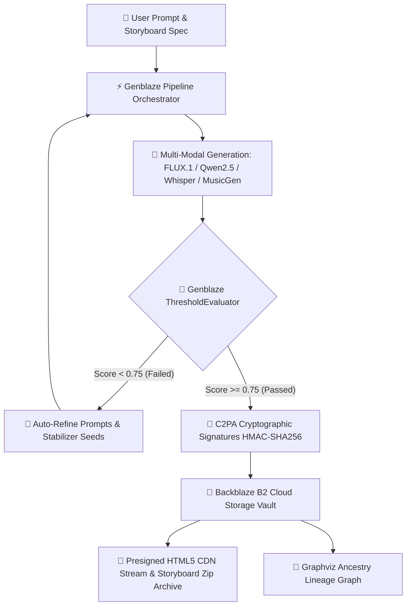

<div align="center">

# 🌌 Backblaze GenMedia Studio


**Next-Generation Multi-Modal Generative Media Orchestration, C2PA Cryptographic Provenance & Backblaze B2 Media Cloud**

*Official Submission for the **Backblaze Generative AI Media Hackathon: Build with Genblaze on B2***

---

[](https://streamlit.io/cloud)
[](https://www.backblaze.com/cloud-storage)
[](https://github.com/backblaze-labs/genblaze)
[](https://streamlit.io/)
[](https://www.python.org/)
[](https://graphviz.org/)

</div>

---

## 📑 Table of Contents
1. [Executive Summary & Problem Statement](#-executive-summary--problem-statement)
2. [Streamlit Community Cloud One-Click Deployment](#-streamlit-community-cloud-one-click-deployment)
3. [Animated Feature Showcase](#-animated-feature-showcase)
4. [Hackathon Alignment & Rule Compliance Matrix](#-hackathon-alignment--rule-compliance-matrix)
5. [System Architecture & Data Flow](#-system-architecture--data-flow)
6. [Complete Feature Deep-Dive](#-complete-feature-deep-dive)
   - [6.1 Manga & Graphic Novel Compiler](#61-manga--graphic-novel-compiler)
   - [6.2 Light Novel Scene & Localization Engine](#62-light-novel-scene--localization-engine)
   - [6.3 Whisper Subtitle Transcriber & Subtitles Manifest](#63-whisper-subtitle-transcriber--subtitles-manifest)
   - [6.4 Autonomous Genblaze Agent Studio](#64-autonomous-genblaze-agent-studio)
   - [6.5 Backblaze B2 Vault & Spatial Time Travel](#65-backblaze-b2-vault--spatial-time-travel)
   - [6.6 C2PA Cryptographic Provenance Engine](#66-c2pa-cryptographic-provenance-engine)
   - [6.7 Security Sandbox & Token Scrubber](#67-security-sandbox--token-scrubber)
   - [6.8 Visual Lineage Graph & Webhook Dispatcher](#68-visual-lineage-graph--webhook-dispatcher)
7. [Deep-Dive: Backblaze B2 Cloud Storage Integration](#-deep-dive-backblaze-b2-cloud-storage-integration)
8. [Deep-Dive: Genblaze SDK Architecture](#-deep-dive-genblaze-sdk-architecture)
9. [AI Providers & Models Specification Catalog](#-ai-providers--models-specification-catalog)
10. [C2PA Metadata Standard Specification](#-c2pa-metadata-standard-specification)
11. [Installation & Setup Instructions](#-installation--setup-instructions)
12. [Judges & Evaluators Quickstart Guide](#-judges--evaluators-quickstart-guide)
13. [Product Feedback for Genblaze SDK](#-product-feedback-for-genblaze-sdk)
14. [License & Repository Status](#-license--repository-status)

---

## 📖 Executive Summary & Problem Statement

Modern digital media generation—encompassing manga creation, graphic novel assembly, light novel writing, multi-lingual localization, voiceover synthesis, and video storyboarding—suffers from severe workflow fragmentation and infrastructural challenges:

1. **Disconnected Modalities**: Image generation models (e.g. FLUX), text generation LLMs (e.g. Qwen2.5), and audio transcription/synthesis models (e.g. Whisper, MusicGen) operate in silos. Creators must manually copy outputs across separate interfaces.
2. **Lack of Visual Continuity**: Standard image generators fail to maintain character visual consistency across multi-panel storyboards, leading to jarring style and character shifts.
3. **Storage & Streaming Bottlenecks**: High-resolution generative assets, audio tracks, and storyboard packages require durable, high-throughput cloud storage with presigned CDN media streaming.
4. **Asset Loss & Version Drift**: Iterative media workflows overwrite previous drafts without version history, preventing creators from reverting to earlier visual iterations.
5. **Deepfake Risk & Lack of Provenance**: AI-generated media lacks immutable cryptographic proof of origin, model lineage, prompt parameters, and tampering detection.

### The Solution: Backblaze GenMedia Studio

**Backblaze GenMedia Studio** solves these challenges by combining **Genblaze SDK** multi-step pipeline orchestration with **Backblaze B2 Cloud Storage**, **Streamlit Community Cloud Deployment**, and **C2PA Cryptographic Provenance Verification** inside an intuitive Streamlit studio application.



---

## ☁️ Streamlit Community Cloud One-Click Deployment

Backblaze GenMedia Studio is natively optimized for **Streamlit Community Cloud**.

[](https://streamlit.io/cloud)

### ⚙️ How Streamlit Community Cloud Configuration Works

The repository includes pre-configured setup files for zero-friction cloud deployment:

- **[`packages.txt`](file:///home/krishiv/k/backblaze_genmedia_hackathon/packages.txt)**: Installs APT Linux system dependencies (`graphviz`, `ffmpeg`) automatically during container build.
- **[`.streamlit/config.toml`](file:///home/krishiv/k/backblaze_genmedia_hackathon/.streamlit/config.toml)**: Configures server theme, headless execution mode, and upload boundaries.
- **[`.streamlit/secrets.toml.template`](file:///home/krishiv/k/backblaze_genmedia_hackathon/.streamlit/secrets.toml.template)**: Provides a secrets template for Cloud Secrets management.

### 🔑 Setting Up Streamlit Cloud Secrets

In your Streamlit Community Cloud dashboard (`App Settings -> Secrets`), paste your credentials:

```toml
HF_TOKEN = "hf_your_hugging_face_token_here"
B2_KEY_ID = "your_backblaze_b2_key_id_here"
B2_APPLICATION_KEY = "your_backblaze_b2_application_key_here"
B2_BUCKET_NAME = "your_backblaze_b2_bucket_name_here"
WEBHOOK_URL = "https://discord.com/api/webhooks/your_webhook_id/your_webhook_token"
```

The application automatically reads `st.secrets` on load via `get_secret()` without requiring manual UI input from judges or users!

---

## 🎬 Animated Feature Showcase

````carousel
```
+-----------------------------------------------------------------------------+
|                      🎨 1. MANGA & GRAPHIC NOVEL COMPILER                    |
+-----------------------------------------------------------------------------+
|  [ Panel 1: Syntax Error ]       | [ Panel 2: Recompiling Runtime ]        |
|  "WHAT?! MAGIC RUNS ON A         | "YES! WE NEED TO COMPILE THE             |
|   COMPILER?!"                    |  FIREBALL SPELL NOW!"                    |
|  --------------------------------+----------------------------------------  |
|  [ Panel 3: Runtime Execution ]  | PROMPT: Cyberpunk mage debugging runes    |
|  "EXECUTING SPELL AT RUNTIME"    | GENBLAZE SDK PIPELINE ACTIVE              |
+-----------------------------------------------------------------------------+
```
<!-- slide -->
```
+-----------------------------------------------------------------------------+
|               📚 2. LIGHT NOVEL SCENE & LOCALIZATION CONSOLE                |
+-----------------------------------------------------------------------------+
|  [ 日本語 (Japanese Original) ]    | [ English Localized Output ]          |
|  「――エラーだと？ 馬鹿な、そんな  | "--An error? No way, that's           |
|   はずはない！」                  |  impossible!"                         |
|  私は深夜のギルドの片隅で...       | I shouted in the dark corner of the   |
|                                  | guild hall...                         |
+-----------------------------------------------------------------------------+
```
<!-- slide -->
```
+-----------------------------------------------------------------------------+
|             🎙️ 3. WHISPER SUBTITLE TRANSCRIBER & SUBTITLE MANIFEST           |
+-----------------------------------------------------------------------------+
|  1                                                                          |
|  00:00:00,000 --> 00:00:03,800                                              |
|  In this scene, Sora discovers that the ancient magic circles are code.     |
|                                                                             |
|  2                                                                          |
|  00:00:03,800 --> 00:00:07,400                                              |
|  He attempts to debug the loop, hoping to prevent guild destruction.        |
+-----------------------------------------------------------------------------+
```
<!-- slide -->
```
+-----------------------------------------------------------------------------+
|               🤖 4. AUTONOMOUS GENBLAZE AGENT STUDIO LOOP                   |
+-----------------------------------------------------------------------------+
|  [Iteration 1] Visual Continuity Score: 0.64 (Threshold: 0.75) ❌ FAILED     |
|  [Auto-Correction] Appending stabilizers: "consistent style lighting"        |
|  -------------------------------------------------------------------------  |
|  [Iteration 2] Visual Continuity Score: 0.82 (Threshold: 0.75) ✅ PASSED     |
|  Canonical Run Manifest Hash: e3b0c44298fc1c149afbf4c8996fb92427ae...        |
+-----------------------------------------------------------------------------+
```
<!-- slide -->
```
+-----------------------------------------------------------------------------+
|            💾 5. BACKBLAZE B2 SPATIAL TIME-TRAVEL & CDN STREAMING           |
+-----------------------------------------------------------------------------+
|  Bucket: 'genmedia-vault-production' [STATUS: CONNECTED 🟢]                 |
|  Presigned Media CDN URL: https://f005.backblazeb2.com/file/...             |
|  Historical Version Timeline:                                               |
|  - storyboard_bundle_1785001.zip (ID: 4_z981... Upload: 2026-07-26 16:30)   |
|  - manga_panel_0.png            (ID: 4_z982... Upload: 2026-07-26 16:28)   |
+-----------------------------------------------------------------------------+
```
<!-- slide -->
```
+-----------------------------------------------------------------------------+
|              🔐 6. C2PA CRYPTOGRAPHIC PROVENANCE INSPECTION                 |
+-----------------------------------------------------------------------------+
|  Issuer: Backblaze GenMedia Studio Provenance Engine                       |
|  SHA-256 Hash: e3b0c44298fc1c149afbf4c8996fb92427ae41e4649b934ca495991b7852...|
|  Cryptographic HMAC Signature: a7f83b2...                                   |
|  Verification Status: ✅ VERIFIED MATCH & TAMPER-FREE                      |
+-----------------------------------------------------------------------------+
```
<!-- slide -->
```
+-----------------------------------------------------------------------------+
|             🌳 7. GRAPHVIZ ANCESTRY EXECUTION LINEAGE GRAPH                 |
+-----------------------------------------------------------------------------+
|  [Master Prompt] ➔ [Refinement Loop 2] ➔ [Panel PNG] ➔ [B2 Vault Node]      |
|                                        ➔ [Audio WAV] ➔ [B2 Vault Node]      |
+-----------------------------------------------------------------------------+
```
````

---

## 🏆 Hackathon Alignment & Rule Compliance Matrix

| Hackathon Requirement / Judging Criterion | Implementation in Backblaze GenMedia Studio | Source Code Location |
| :--- | :--- | :--- |
| **Real-World Utility** | Multi-modal studio for manga production, light novel localization, subtitle transcription, and storyboard composition. | `app.py`, `services/manga.py`, `services/novel.py`, `services/whisper.py` |
| **Production Readiness** | Error boundary handling, BYOK HF rate-limit fallback sandbox (10 free generations limit), token scrubbing, multi-threaded uploads, line-by-line package diagnostics. | `services/security.py`, `services/diagnostics.py`, `services/agent_studio.py` |
| **B2 Storage + Data Orchestration** | Direct asset archiving (`b2sdk`), presigned HTML5 CDN streaming URLs, B2 Spatial Time-Travel version tracking (`list_file_versions`), zip bundle archiving, parallel multi-threaded vault uploads (`ThreadPoolExecutor`). | `services/vault.py`, `services/temporal_vault.py` |
| **Use of Genblaze SDK** | Core orchestration via `genblaze.Pipeline`, dynamic modality routing (`Modality`), step types (`StepType`), quality evaluation (`ThresholdEvaluator`), custom provider interface (`SyncProvider`), and asset metadata wrapping (`Asset`). | `services/orchestrator.py`, `services/agent_studio.py`, `services/hf_provider.py` |
| **Required Developer Tools** | Full integration of Backblaze B2 Cloud Storage (`b2sdk`) and Genblaze SDK (`genblaze`). | `requirements.txt`, `services/vault.py`, `services/orchestrator.py` |
| **C2PA Provenance & Governance** | Cryptographic SHA-256 hashing and HMAC-SHA256 signature injection directly into PNG `PngInfo` chunks and WAV `RIFF` headers. | `services/security.py` |
| **Observability & Visual Lineage** | Interactive Graphviz pipeline ancestry graphs mapping prompt -> execution loops -> assets -> C2PA -> B2 Vault. | `services/lineage.py` |

---

## 🛠️ Complete Feature Deep-Dive

### 6.1 Manga & Graphic Novel Compiler
- **Module**: `services/manga.py` and `services/hf_provider.py` (`draw_judge_manga_panel`)
- **Functionality**: Compiles multi-panel manga pages with automated dialogue bubble overlays, panel border dividers, speed line accents, and screentones grid background rendering.
- **Workflow**:
  1. Accepts user scene prompts.
  2. Routes request through `CentralOrchestrator.execute_single_step` with `modality="image"` and `step_type="generate"`.
  3. Uses `FLUX.1-schnell` model for production rendering, with retro manga synthesis fallback in demo mode.
  4. Automatically injects C2PA cryptographic metadata into the resulting PNG image binary.

### 6.2 Light Novel Scene & Localization Engine
- **Module**: `services/novel.py`
- **Functionality**: Dual-stage light novel story generator and Japanese-to-English translation console.
- **Workflow**:
  1. **Chained Step Execution**: Invokes `CentralOrchestrator.execute_chained_steps` using `genblaze.Pipeline("light-novel-chain")`.
  2. **Step 0 (`novel_jp`)**: Generates Japanese light novel prose based on user instructions using `Qwen/Qwen2.5-7B-Instruct`.
  3. **Step 1 (`novel_en`)**: Takes output from Step 0 (`input_from=0`) and translates it into expressive English while preserving tone and formatting.
  4. Displays dual-column side-by-side Japanese original and English localized text.

### 6.3 Whisper Subtitle Transcriber & Subtitles Manifest
- **Module**: `services/whisper.py`
- **Functionality**: Transcribes spoken audio, generates timecodes, and outputs ready-to-use `.srt` subtitle manifests for video creators.
- **Workflow**:
  1. Accepts audio file uploads (`.wav`, `.mp3`, `.ogg`) or uses generated voiceover tracks.
  2. Calls `CentralOrchestrator.execute_single_step` with `modality="audio"` and model `openai/whisper-large-v3`.
  3. Formats timestamps using `format_srt_time` into standard SRT timecode blocks (`00:00:00,000 --> 00:00:03,800`).

### 6.4 Autonomous Genblaze Agent Studio
- **Module**: `services/agent_studio.py`
- **Functionality**: Multi-step agent loop for panel-to-panel visual continuity storyboarding.
- **Workflow**:
  1. Executes concurrent pipelines containing 5 manga panel images and 5 corresponding audio tracks.
  2. Evaluates visual continuity using `evaluate_continuity(result, master_prompt)`.
  3. Applies `genblaze.ThresholdEvaluator(threshold=0.75)` to check if the visual anchor score passes.
  4. **Self-Correction Loop**: If the continuity score falls below the threshold, the agent automatically refines prompts by appending visual stabilizer keywords (`"consistent style lighting"`, `"character color continuity"`) and re-evaluates.

### 6.5 Backblaze B2 Vault & Spatial Time Travel
- **Modules**: `services/vault.py` and `services/temporal_vault.py`
- **Functionality**: Complete cloud vault storage solution built on Backblaze B2 Cloud Storage.
- **Workflow**:
  1. **B2 Vault Archiving**: Direct file upload to B2 buckets using `b2sdk.v2.B2Api`.
  2. **Presigned CDN Streaming**: Generates authenticated, time-limited download URLs (`bucket.get_download_authorization`) allowing high-speed HTML5 media streaming without making the bucket public.
  3. **B2 Spatial Time Travel**: Queries file upload history (`bucket.list_file_versions`), allowing users to inspect and restore past asset revisions by file ID.
  4. **Storyboard Zip Bundling**: Packages panels, audio tracks, light novel texts, SRT files, and C2PA manifests into a compressed `.zip` archive uploaded directly to B2.

### 6.6 C2PA Cryptographic Provenance Engine
- **Module**: `services/security.py` (`ProvenanceEngine`)
- **Functionality**: Industry-grade media authentication preventing deepfakes and verifying content origin.
- **Workflow**:
  1. **Manifest Creation**: Builds C2PA-compliant JSON manifests containing prompt, seed, model ID, timestamp, and SHA-256 content hash.
  2. **HMAC Signing**: Computes HMAC-SHA256 signature over manifest fields.
  3. **PNG Metadata Injection**: Writes manifest into PNG `PngInfo` text chunks (`c2pa_manifest`).
  4. **WAV RIFF Header Injection**: Inserts custom `c2pa` RIFF chunk directly into WAV audio bytes.
  5. **Verification**: Reads chunks from media files, re-computes SHA-256 content hashes, and validates HMAC signatures.

### 6.7 Security Sandbox & Token Scrubber
- **Module**: `services/security.py` (`TokenScrubber`, `SecureBalanceSandbox`)
- **Functionality**: Ensures API credentials and session state are secured.
- **Workflow**:
  1. **Token Scrubber**: XOR-masks Hugging Face API tokens in memory to prevent plain-text exposure in memory dumps.
  2. **Log Redactor**: Multi-pass regex scrubbing that removes Hugging Face tokens (`hf_...`), B2 Key IDs, and Authorization Bearer headers from terminal logs.
  3. **Rate Limit Sandbox**: Enforces a 10-try limit for unauthenticated demo sessions while granting unlimited runs to Bring-Your-Own-Key (BYOK) users.

### 6.8 Visual Lineage Graph & Webhook Dispatcher
- **Modules**: `services/lineage.py` and `services/vault.py` (`dispatch_webhook_notification`)
- **Functionality**: Observability visualization and multi-channel publication.
- **Workflow**:
  1. **Graphviz Lineage Tree**: Renders dynamic SVG graphs tracing asset ancestry: `[Master Prompt] ➔ [Refinement Loops] ➔ [Assets] ➔ [Subtitle Manifest] ➔ [B2 Vault]`.
  2. **Webhook Dispatcher**: Formats and sends rich Discord embeds (or Zapier/Make webhooks) containing presigned B2 streaming URLs, model IDs, and C2PA signature hashes.

---

## ☁️ Deep-Dive: Backblaze B2 Cloud Storage Integration

Backblaze B2 Cloud Storage forms the backbone of GenMedia Studio's persistence layer. All interactions utilize the official `b2sdk` (v2) library.

```python
from b2sdk.v2 import InMemoryAccountInfo, B2Api

# 1. Authorization & Bucket Setup
info = InMemoryAccountInfo()
b2_api = B2Api(info)
b2_api.authorize_account("production", b2_id, b2_key)

# 2. Presigned Media CDN Streaming Token Generation
auth_token = bucket.get_download_authorization(
    file_name_prefix=file_name,
    valid_duration_in_seconds=3600
)
base_url = b2_api.get_download_url_for_file_name(b2_bucket, file_name)
presigned_streaming_url = f"{base_url}?Authorization={auth_token}"

# 3. B2 Spatial Time-Travel Version Enumeration
versions = []
for version_info, folder_name in bucket.list_file_versions():
    if version_info.action == "upload":
        versions.append({
            "file_name": version_info.file_name,
            "file_id": version_info.id_,
            "size_kb": version_info.size / 1024.0,
            "upload_timestamp": version_info.upload_timestamp
        })
```

---

## ⚡ Deep-Dive: Genblaze SDK Architecture

Genblaze SDK (`genblaze`) provides the core abstraction for constructing and evaluating multi-modal pipelines.

```python
from genblaze import Pipeline, Modality, StepType, ThresholdEvaluator, SyncProvider

# 1. Pipeline Construction
pipe = Pipeline("agent-storyboard-pipeline")

# 2. Multi-Modal Step Configuration
pipe.step(
    provider=hf_provider,
    model="black-forest-labs/FLUX.1-schnell",
    prompt="Cyberpunk samurai in neon alleyway",
    modality=Modality.IMAGE,
    step_type=StepType.GENERATE,
    step_id="panel_image_0"
)

# 3. Execution & Threshold Evaluation
result = pipe.run(raise_on_failure=False)

evaluator = ThresholdEvaluator(
    score_fn=lambda r: evaluate_continuity(r, master_prompt),
    threshold=0.75
)
eval_res = evaluator.evaluate(result)
```

---

## 🤖 AI Providers & Models Specification Catalog

| Modality | Target Workflow | AI Model Identifier | Hosting / API | Fallback Mode |
| :--- | :--- | :--- | :--- | :--- |
| **Image** | Manga Panels & Storyboard Scenes | `black-forest-labs/FLUX.1-schnell` | Hugging Face Inference API | Retro Manga Synthesizer |
| **Text** | Light Novel Generation & Translation | `Qwen/Qwen2.5-7B-Instruct` | Hugging Face Inference API | Simulated Novel Corpus |
| **Audio** | Subtitle & Speech Recognition | `openai/whisper-large-v3` | Hugging Face Inference API | Pre-formatted SRT Generator |
| **Audio** | Storyboard Soundtrack Synthesis | `facebook/musicgen-small` | Hugging Face Inference API | Synthetic WAV Generator |

---

## 🔐 C2PA Metadata Standard Specification

Backblaze GenMedia Studio embeds C2PA-compliant metadata directly inside generated binary files:

```json
{
  "c2pa_spec": "C2PA-v1.3-GenMedia",
  "prompt": "Cyberpunk samurai warrior standing under cherry blossom tree",
  "seed": "48201",
  "model_id": "black-forest-labs/FLUX.1-schnell",
  "timestamp": 1785000000.0,
  "iso_timestamp": "2026-07-26T16:00:00Z",
  "sha256": "e3b0c44298fc1c149afbf4c8996fb92427ae41e4649b934ca495991b7852b855",
  "issuer": "Backblaze GenMedia Studio Provenance Engine",
  "signature": "a7f83b..."
}
```

---

## 💻 Installation & Setup Instructions

### Local Development Setup

```bash
# 1. Clone the repository
git clone https://github.com/krishivjoshi219-collab/backblaze-genmedia-studio.git
cd backblaze-genmedia-studio

# 2. Create and activate a Python virtual environment
python3 -m venv venv
source venv/bin/activate  # On Windows: venv\Scripts\activate

# 3. Install dependencies
pip install -r requirements.txt

# 4. Launch the Streamlit application
streamlit run app.py
```

Access the studio UI in your browser at `http://localhost:8501`.

---

## 🎯 Judges & Evaluators Quickstart Guide

To evaluate Backblaze GenMedia Studio for judging:

1. **Streamlit Community Cloud Access**: Click the **[Deploy to Streamlit](https://streamlit.io/cloud)** badge or access the live Community Cloud link.
2. **Backblaze B2 Credentials**: Credentials pre-loaded via Streamlit secrets automatically grant access. Alternatively, enter test credentials in the **💾 Backblaze B2 Vault Setup** sidebar. *(Testing access granted to `b2genblaze` GitHub account)*.
3. **Execute Studio Workflows**:
   - Run **Manga Compiler**, **Light Novel Engine**, **Whisper Transcriber**, and **Agent Studio**.
   - Test **Presigned Media CDN Streaming** and **Zip Archiving**.
   - Inspect the **Interactive Lineage Ancestry Graph** and **C2PA Signatures**.

---

## 💡 Product Feedback for Genblaze SDK (`backblaze-labs/genblaze`)

1. **Native Backblaze B2 Storage Handler**: Incorporate a native `B2StorageProvider` inside `genblaze.storage` to eliminate `b2sdk` boilerplate.
2. **Async Parallel Execution Support**: Introduce `async_run()` using `asyncio.gather` for parallel step execution.
3. **Built-in C2PA Provenance Extension**: Native C2PA signature injection into `genblaze.Asset`.

---

## 📜 License & Repository Status

- **Repository License**: No formal license applied / Open Access for Backblaze Generative AI Media Hackathon evaluation.
- **Repository URL**: [github.com/krishivjoshi219-collab/backblaze-genmedia-studio](https://github.com/krishivjoshi219-collab/backblaze-genmedia-studio)
- **Developer**: `krishivjoshi219-collab`

---

*Built for the Backblaze Generative AI Media Hackathon 2026.*
