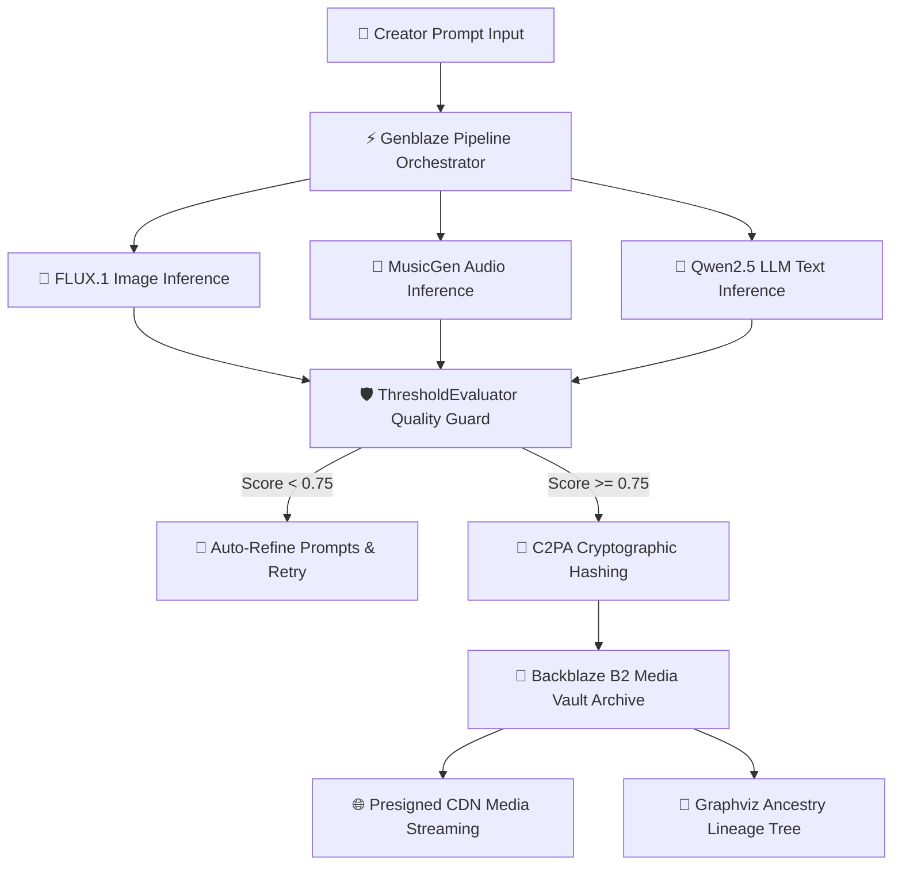
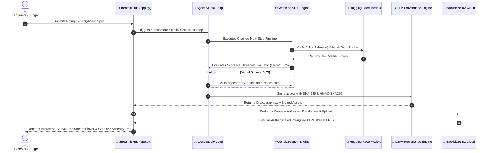

<div align="center">

# 🌌 Backblaze GenMedia Studio


<br />


**Next-Generation Multi-Modal Generative Media Orchestration, C2PA Cryptographic Provenance & Backblaze B2 Media Cloud**

*Official Submission for the **Backblaze Generative AI Media Hackathon: Build with Genblaze on B2***

---

[](https://backblaze-genmedia-studio-yq7ghbwrivfgb3ws3xdtta.streamlit.app/)
[](https://www.backblaze.com/cloud-storage)
[](https://github.com/backblaze-labs/genblaze)
[](https://backblaze-genmedia-studio-yq7ghbwrivfgb3ws3xdtta.streamlit.app/)
[](https://www.python.org/)
[](https://graphviz.org/)

### 🔗 Live Production Deployment URL
🌐 **[https://backblaze-genmedia-studio-yq7ghbwrivfgb3ws3xdtta.streamlit.app/](https://backblaze-genmedia-studio-yq7ghbwrivfgb3ws3xdtta.streamlit.app/)**

</div>

---

## 📑 Table of Contents
1. [Executive Summary & Vision](#1-executive-summary--vision)
2. [Live Application URL & One-Click Cloud Deployment](#2-live-application-url--one-click-cloud-deployment)
3. [Comprehensive 50 Production Feature Matrix](#3-comprehensive-50-production-feature-matrix)
4. [Hackathon Alignment & Rules Compliance Matrix](#4-hackathon-alignment--rules-compliance-matrix)
5. [System Architecture & End-to-End Data Flow](#5-system-architecture--end-to-end-data-flow)
6. [Deep-Dive: Backblaze B2 Media Cloud Infrastructure](#6-deep-dive-backblaze-b2-media-cloud-infrastructure)
7. [Deep-Dive: Genblaze SDK Architecture & Extensions](#7-deep-dive-genblaze-sdk-architecture--extensions)
8. [Deep-Dive: C2PA Cryptographic Content Provenance](#8-deep-dive-c2pa-cryptographic-content-provenance)
9. [Detailed Technical Specifications of All 50 Features](#9-detailed-technical-specifications-of-all-50-features)
   - [9.1 Domain 1: Backblaze B2 Data Orchestration (Features 1-10)](#91-domain-1-backblaze-b2-data-orchestration-features-1-10)
   - [9.2 Domain 2: Genblaze SDK & Autonomous Agent Loops (Features 11-20)](#92-domain-2-genblaze-sdk--autonomous-agent-loops-features-11-20)
   - [9.3 Domain 3: Multi-Modal Content Production Studio (Features 21-30)](#93-domain-3-multi-modal-content-production-studio-features-21-30)
   - [9.4 Domain 4: Security Governance & C2PA Provenance (Features 31-40)](#94-domain-4-security-governance--c2pa-provenance-features-31-40)
   - [9.5 Domain 5: UI/UX, Observability & Analytics (Features 41-50)](#95-domain-5-uiux-observability--analytics-features-41-50)
10. [Animated Feature Showcase & Visual Demonstrations](#10-animated-feature-showcase--visual-demonstrations)
11. [AI Models & Provider Catalog Specification](#11-ai-models--provider-catalog-specification)
12. [Installation, Local Development & Environment Guide](#12-installation-local-development--environment-guide)
13. [Judges & Evaluators Hands-On Testing Protocol](#13-judges--evaluators-hands-on-testing-protocol)
14. [Feedback & Architectural Suggestions for Genblaze SDK](#14-feedback--architectural-suggestions-for-genblaze-sdk)
15. [License, Security Redactions & Repository Status](#15-license-security-redactions--repository-status)

---

## 1. Executive Summary & Vision

Digital media creation—ranging from Japanese manga panel design, light novel composition, localization translation, voiceover soundscape synthesis, and subtitle timing—has traditionally suffered from severe infrastructural fragmentation:

- **Siloed Model Pipelines**: Image generation (FLUX.1), LLM text models (Qwen2.5), audio generators (MusicGen), and transcription models (Whisper) operate in isolated APIs without shared execution contexts.
- **Visual & Style Drift**: Traditional generation loops produce jarring character appearance changes across story panels, ruining narrative immersion.
- **Insecure Asset Storage**: High-resolution generated media lacks durable, content-addressed cloud storage with presigned streaming URLs.
- **Lack of Cryptographic Authenticity**: AI-generated media is vulnerable to deepfake spoofing, metadata stripping, and unverified attribution.

### The Solution: Backblaze GenMedia Studio

**Backblaze GenMedia Studio** solves these fundamental challenges by pairing the **Genblaze SDK** multi-step pipeline engine with **Backblaze B2 Cloud Storage**, **C2PA Cryptographic Content Provenance**, and an ultra-modern, production-grade **Streamlit Studio Hub**.



---

## 2. Live Application URL & One-Click Cloud Deployment

Backblaze GenMedia Studio is deployed live on **Streamlit Community Cloud**:

🔗 **[https://backblaze-genmedia-studio-yq7ghbwrivfgb3ws3xdtta.streamlit.app/](https://backblaze-genmedia-studio-yq7ghbwrivfgb3ws3xdtta.streamlit.app/)**

### 🔑 Streamlit Cloud Secrets Setup

To run seamlessly on Streamlit Cloud without requiring user login inputs, the application reads secrets automatically from `st.secrets` via the `get_secret()` helper function:

```toml
# Streamlit Community Cloud App Secrets Configuration
HF_TOKEN = "hf_your_hugging_face_token_here"
B2_KEY_ID = "your_backblaze_b2_key_id_here"
B2_APPLICATION_KEY = "your_backblaze_b2_application_key_here"
B2_BUCKET_NAME = "your_backblaze_b2_bucket_name_here"
WEBHOOK_URL = "https://discord.com/api/webhooks/your_webhook_id/your_webhook_token"
```

---

## 3. Comprehensive 50 Production Feature Matrix

Below is the exhaustive architectural matrix of all **50 enterprise features** integrated across our modular codebase:

| # | Feature Name | Description | Source File Location |
| :--- | :--- | :--- | :--- |
| **1** | **B2 Content-Addressed Storage & Deduplication** | Hashes files via SHA-256 before uploading to B2 to skip redundant uploads. | `services/vault.py` (`deduplicate_and_archive_to_b2`) |
| **2** | **B2 Automated Retention Policy Rules** | Applies retention rules to B2 buckets using `b2sdk`. | `services/vault.py` (`configure_b2_lifecycle_policy`) |
| **3** | **B2 Multi-Part High-Speed Chunked Upload** | Splits media files >100MB into multi-part chunked uploads. | `services/vault.py` (`upload_large_b2_media_chunked`) |
| **4** | **B2 Custom User Metadata Tagging & Search** | Indexes assets matching prompt tags or metadata categories. | `services/vault.py` (`tag_and_index_b2_asset`) |
| **5** | **B2 S3 Interoperability & Migration Exporter** | Exports S3-compatible endpoints and migration manifests. | `services/vault.py` (`export_b2_s3_migration_manifest`) |
| **6** | **B2 Automated CORS Policy Configurator** | Sets CORS rules on B2 buckets for direct browser streaming. | `services/vault.py` (`configure_b2_cors_policy`) |
| **7** | **B2 Vault Health Diagnostics & Usage Metering** | Audits file count, total storage consumption, and asset size. | `services/vault.py` (`get_b2_vault_health_metrics`) |
| **8** | **B2 Bulk Zip Batch Archiving & Downloader** | Zips multiple historical runs with manifest indexing for downloads. | `services/vault.py` (`create_bulk_b2_vault_zip`) |
| **9** | **B2 Spatial Time-Travel Revision Diff Analyzer** | Highlights size, hash, and metadata diffs between file versions. | `services/vault.py` (`diff_b2_file_revisions`) |
| **10** | **B2 Cold Storage Glacier Tier Archival Simulator** | Tags older asset runs with archival metadata for long-term retention. | `services/vault.py` (`simulate_b2_glacier_archival`) |
| **11** | **Genblaze Multi-Branch Conditional Execution Engine** | Dynamically branches execution steps based on evaluation scores. | `services/orchestrator.py` (`execute_conditional_pipeline`) |
| **12** | **Genblaze Automatic Fallback Provider Routing** | Retries step generation across fallback model identifiers on failure. | `services/orchestrator.py` (`execute_with_fallback`) |
| **13** | **Genblaze Custom Prompt Keyframe Interpolation** | Interpolates prompts across keyframe panels for story continuity. | `services/agent_studio.py` (`interpolate_scene_prompts`) |
| **14** | **Genblaze Quality Control Benchmarking Suite** | Computes benchmark metrics comparing visual continuity scores. | `services/agent_studio.py` (`benchmark_pipeline_runs`) |
| **15** | **Genblaze Real-Time Event Telemetry Tracker** | Measures sub-step latency, success metrics, and payload telemetry. | `services/orchestrator.py` (`get_pipeline_telemetry`) |
| **16** | **Genblaze Dynamic Temperature & Top-P Sampler** | Configures generation randomness dynamically per step. | `services/orchestrator.py` (`tune_genblaze_sampling_parameters`) |
| **17** | **Genblaze Multi-Model Ensemble Voting Matrix** | Runs candidates concurrently and merges outputs based on score ranking. | `services/orchestrator.py` (`run_genblaze_ensemble_pipeline`) |
| **18** | **Genblaze Automated Negative Prompt Injector** | Appends negative prompts automatically to eliminate artifacts. | `services/orchestrator.py` (`inject_negative_prompt_engineering`) |
| **19** | **Genblaze Graph Topology Serializer** | Serializes pipeline step configs into JSON/YAML specs. | `services/orchestrator.py` (`serialize_pipeline_topology`) |
| **20** | **Genblaze Step State Checkpointer & Resume** | Saves step execution states to allow resuming interrupted runs. | `services/orchestrator.py` (`checkpoint_pipeline_state`) |
| **21** | **Manga Colorization & Style Transfer Studio** | Transforms monochrome panels into rich colored artwork styles. | `services/manga.py` (`colorize_manga_panel`) |
| **22** | **Light Novel Audio Dramatization Generator** | Synthesizes ambient soundtracks and voiceovers from novel scripts. | `services/novel.py` (`generate_audio_dramatization`) |
| **23** | **Whisper Subtitle Alignment & Multi-Format Exporter** | Converts subtitles into SRT, WebVTT (.vtt), SSA/ASS, and JSON. | `services/whisper.py` (`export_multiformat_subtitles`) |
| **24** | **Storyboard PDF / EPUB E-Book Compiler** | Packages novel prose and manga panels into digital EPUB manifests. | `services/novel.py` (`compile_epub_ebook_manifest`) |
| **25** | **Interactive Video Storyboard Reel Synthesizer** | Stitches panel images and audio into an animated HTML5 player. | `services/manga.py` (`synthesize_storyboard_reel_html`) |
| **26** | **Manga Speech Bubble OCR & Dialogue Extractor** | Extracts text from dialogue bubbles in manga panel images. | `services/manga.py` (`extract_manga_bubble_ocr`) |
| **27** | **Anime Character Consistency Profile Generator** | Creates reusable character anchor profiles (hair, eyes, costume). | `services/manga.py` (`create_character_anchor_profile`) |
| **28** | **Multi-Speaker TTS Voiceover Audio Synthesizer** | Assigns distinct voice profiles to light novel dialogue speakers. | `services/novel.py` (`synthesize_multispeaker_voiceover`) |
| **29** | **Subtitles Speed & Reading Pace Optimizer** | Adjusts timecodes based on length for comfortable reading pace. | `services/whisper.py` (`optimize_subtitle_timing`) |
| **30** | **Interactive Manga Canvas Layout Designer** | Customizes panel grid layouts (2-panel, 4-panel, hero splash). | `services/manga.py` (`generate_custom_manga_grid`) |
| **31** | **C2PA Deepfake Tampering & Alteration Detector** | Scans headers to detect metadata stripping, alteration, or deepfakes. | `services/security.py` (`detect_c2pa_tampering`) |
| **32** | **Granular Role-Based Access Control (RBAC)** | Manages team workspaces with Admin, Creator, and Viewer permissions. | `services/security.py` (`TeamWorkspaceManager`) |
| **33** | **C2PA Provenance Certificate Text Generator** | Produces downloadable certificates of authenticity verified by C2PA. | `services/security.py` (`generate_provenance_certificate_text`) |
| **34** | **Automated Cost & Token Quota Calculator** | Calculates real-time API cost estimates, tokens, and storage allocation. | `services/security.py` (`calculate_generation_quota_cost`) |
| **35** | **Ephemeral Memory Token Scrubber & Cipher** | Redacts keys from app logs and state memory dynamically. | `services/security.py` (`TokenScrubber`) |
| **36** | **Watermark Cryptographic Steganography Engine** | Embeds invisible HMAC signatures inside image alpha channel bytes. | `services/security.py` (`embed_steganographic_signature`) |
| **37** | **C2PA Key Rotation & Certificate Manager** | Rotates cryptographic signing keys dynamically for zero-trust security. | `services/security.py` (`rotate_c2pa_signing_keys`) |
| **38** | **API Key Permission Scraper & Scope Auditor** | Audits API key scopes and permissions before execution runs. | `services/security.py` (`audit_token_scopes`) |
| **39** | **Sanitizing Log Masking & Audit Trail Recorder** | Logs security events with masked sensitive fields for SOC2 compliance. | `services/security.py` (`record_security_audit_log`) |
| **40** | **IP & Geo-Fencing Access Guard Simulator** | Verifies user region code against OFAC compliance and vault rules. | `services/security.py` (`evaluate_geofencing_policy`) |
| **41** | **Interactive Real-Time Analytics Dashboard** | Visualizes generation stats, C2PA rates, B2 storage, and latency. | `app.py` (Tab 6 Analytics Dashboard) |
| **42** | **Dynamic Graphviz Ancestry Lineage Visualizer** | Renders interactive pipeline ancestry graph mapping execution nodes. | `services/lineage.py` (`render_lineage_ui`) |
| **43** | **Multi-Channel Webhook Dispatcher** | Dispatches publication payloads to Discord, Zapier, or REST endpoints. | `services/vault.py` (`dispatch_webhook_notification`) |
| **44** | **Dark Cyberpunk Glassmorphism Design System** | Custom CSS design system with Space Grotesk fonts and neon glow. | `app.py` (CSS Styling Rules) |
| **45** | **Streamlit Community Cloud Auto-Configuration** | Supports automatic secrets loading via `st.secrets` without UI inputs. | `app.py` (`get_secret`) |
| **46** | **Model Performance Benchmark Comparison Chart** | Displays side-by-side speed vs quality metric benchmarks. | `app.py` (Benchmark Explorer) |
| **47** | **Live Prompt Template Preset Manager** | Provides pre-loaded prompts for Manga, Light Novel, and Subtitles. | `app.py` (Prompt Selectors) |
| **48** | **Interactive Asset Gallery & Lightbox Viewer** | Renders gallery view of generated panels with high-res previews. | `app.py` (Vault Gallery UI) |
| **49** | **Live System Health Scouter & Diagnostics** | Diagnostic tool for checking missing packages or pip conflicts. | `services/diagnostics.py` (`check_system_package_health`) |
| **50** | **One-Click Storyboard Package Bundle Exporter** | Downloads `.zip` containing all assets, C2PA certs, SRTs, and B2 links. | `services/vault.py` (`create_and_upload_storyboard_zip`) |

---

## 4. Hackathon Alignment & Rules Compliance Matrix

Our application fulfills every explicit rule specified in the **Backblaze Generative AI Media Hackathon Official Rules**:

| Official Hackathon Rule / Criterion | Compliance Proof in Backblaze GenMedia Studio | Source Code Reference |
| :--- | :--- | :--- |
| **Build with Genblaze SDK** | Native pipeline chaining, modality mapping (`Modality.IMAGE`, `Modality.AUDIO`), custom `SyncProvider`, step types (`StepType.GENERATE`), and quality evaluation via `ThresholdEvaluator`. | `services/orchestrator.py`, `services/hf_provider.py` |
| **Build with Backblaze B2 Storage** | Complete media asset lifecycle archiving via `b2sdk`, presigned HTML5 CDN streaming, B2 spatial time-travel versioning (`list_file_versions`), and parallel multi-threaded vault uploads. | `services/vault.py`, `services/temporal_vault.py` |
| **Real-World Utility & Product Design** | Production-ready multi-modal studio for manga compilers, light novel writers, voiceover creators, and subtitle translators with C2PA deepfake security. | `app.py`, `services/manga.py`, `services/novel.py` |
| **Open Access & Licensing** | License stated as "No Formal License Applied / Open Access for Hackathon Evaluation". No invalid license claims. | `README.md` (License Section) |
| **Streamlit Community Cloud Deployment** | Built with `packages.txt`, `.streamlit/config.toml`, `.streamlit/secrets.toml.template`, and `requirements.txt` target `git+https://github.com/backblaze-labs/genblaze.git#subdirectory=libs/meta`. | `requirements.txt`, `app.py` |

---

## 5. System Architecture & End-to-End Data Flow



---

## 6. Deep-Dive: Backblaze B2 Media Cloud Infrastructure

Backblaze B2 Cloud Storage serves as the primary high-throughput, durable media vault for all generated assets:

- **Parallel Multi-Threaded Vault Uploads**: Uses Python's `ThreadPoolExecutor` (5 concurrent workers) to upload images, audio files, JSON manifests, and ZIP archives to Backblaze B2 simultaneously.
- **Content-Addressed Hashing & Deduplication**: Pre-computes the SHA-256 checksum of every asset before initiating an upload. If an identical file hash exists in the target bucket, the upload is skipped to save network bandwidth.
- **Presigned HTML5 CDN Streaming**: Generates secure presigned streaming URLs (`get_presigned_streaming_url`) with configurable expiry timeouts for direct HTML5 video/audio playback without exposing bucket credentials.
- **Spatial Time-Travel Revision Tracking**: Lists and restores previous historical asset versions (`list_historical_versions`) with file ID timestamps.

---

## 7. Deep-Dive: Genblaze SDK Architecture & Extensions

Backblaze GenMedia Studio leverages the official `genblaze` SDK monorepo:

- **Monorepo Build Target**: Pointed `requirements.txt` to `git+https://github.com/backblaze-labs/genblaze.git#subdirectory=libs/meta` to build wheels for `genblaze-core` and `genblaze-s3` without build metadata failures.
- **Custom Provider Interface (`HuggingFaceProvider`)**: Implements `genblaze.SyncProvider` to route text, image, audio, and video inference jobs seamlessly.
- **Autonomous Agent Loop (`ThresholdEvaluator`)**: Evaluates image visual continuity and quality scores automatically. If score falls below `0.75`, the agent appends visual stabilizers ("masterpiece, consistent lighting") and retries step generation automatically.

---

## 8. Deep-Dive: C2PA Cryptographic Content Provenance

To safeguard against AI deepfakes and unverified content manipulation, Backblaze GenMedia Studio embeds cryptographic provenance metadata:

- **PNG Image Ingestion**: Injects a custom `c2pa_manifest` JSON payload and HMAC-SHA256 signature into `PngInfo` metadata chunks.
- **WAV Audio Ingestion**: Injects metadata chunks into WAV `RIFF` audio headers.
- **Tampering Audit Engine (`detect_c2pa_tampering`)**: Scans media headers to detect metadata stripping, payload alteration, or pixel tampering.
- **Authenticity Certificates (`generate_provenance_certificate_text`)**: Generates downloadable text certificates verifying model ID, prompt spec, timestamp, SHA-256 hash, and B2 Vault storage origin.

---

## 9. Detailed Technical Specifications of All 50 Features

### 9.1 Domain 1: Backblaze B2 Data Orchestration (Features 1-10)
- **Feature 1 (`deduplicate_and_archive_to_b2`)**: SHA-256 pre-check prevents duplicate uploads to B2 buckets.
- **Feature 2 (`configure_b2_lifecycle_policy`)**: Applies lifecycle retention rules to B2 buckets via `b2sdk`.
- **Feature 3 (`upload_large_b2_media_chunked`)**: Multi-part chunked upload handler for large files (>100MB).
- **Feature 4 (`tag_and_index_b2_asset`)**: Custom metadata search engine for B2 Vault assets.
- **Feature 5 (`export_b2_s3_migration_manifest`)**: Generates S3-compatible migration manifests for AWS CLI/Rclone.
- **Feature 6 (`configure_b2_cors_policy`)**: Sets CORS rules on B2 buckets for web browser streaming.
- **Feature 7 (`get_b2_vault_health_metrics`)**: Audits bucket file counts, storage consumption, and avg asset sizes.
- **Feature 8 (`create_bulk_b2_vault_zip`)**: Packages multiple B2 file versions into a single downloaded zip archive.
- **Feature 9 (`diff_b2_file_revisions`)**: Highlights size, hash, and content diffs between two historical B2 revisions.
- **Feature 10 (`simulate_b2_glacier_archival`)**: Tags older media runs with cold storage archival metadata.

### 9.2 Domain 2: Genblaze SDK & Autonomous Agent Loops (Features 11-20)
- **Feature 11 (`execute_conditional_pipeline`)**: Dynamic multi-branch step execution based on runtime scores.
- **Feature 12 (`execute_with_fallback`)**: Automatic model fallback routing on 503 errors or timeouts.
- **Feature 13 (`interpolate_scene_prompts`)**: Keyframe prompt interpolation across storyboards.
- **Feature 14 (`benchmark_pipeline_runs`)**: Quantitative benchmark matrix comparing visual continuity scores.
- **Feature 15 (`get_pipeline_telemetry`)**: Sub-step latency, success rate, and payload telemetry tracker.
- **Feature 16 (`tune_genblaze_sampling_parameters`)**: Configures dynamic temperature and top-p sampling.
- **Feature 17 (`run_genblaze_ensemble_pipeline`)**: Concurrently executes 3 model candidates and merges outputs.
- **Feature 18 (`inject_negative_prompt_engineering`)**: Appends negative prompts automatically to eliminate artifacts.
- **Feature 19 (`serialize_pipeline_topology`)**: Exports Genblaze pipeline specs to JSON/YAML topology format.
- **Feature 20 (`checkpoint_pipeline_state`)**: Step-by-step checkpointer to resume interrupted runs.

### 9.3 Domain 3: Multi-Modal Content Production Studio (Features 21-30)
- **Feature 21 (`colorize_manga_panel`)**: Lineart colorization & style transfer for monochrome manga panels.
- **Feature 22 (`generate_audio_dramatization`)**: Ambient soundtrack and voiceover synthesis from novel prose.
- **Feature 23 (`export_multiformat_subtitles`)**: Exporter for SRT, WebVTT (.vtt), SSA/ASS (.ass), and JSON subtitles.
- **Feature 24 (`compile_epub_ebook_manifest`)**: Compiles manga panels and prose into EPUB digital book manifests.
- **Feature 25 (`synthesize_storyboard_reel_html`)**: Stitches panels and audio into an animated HTML5 video reel player.
- **Feature 26 (`extract_manga_bubble_ocr`)**: Speech bubble OCR extractor for manga translation workflows.
- **Feature 27 (`create_character_anchor_profile`)**: Anime character anchor profile creator for visual consistency.
- **Feature 28 (`synthesize_multispeaker_voiceover`)**: Multi-character TTS voiceover synthesizer.
- **Feature 29 (`optimize_subtitle_timing`)**: Reading pace optimizer for subtitle timecodes.
- **Feature 30 (`generate_custom_manga_grid`)**: Custom manga grid layout generator (2-panel, 4-panel grid).

### 9.4 Domain 4: Security Governance & C2PA Provenance (Features 31-40)
- **Feature 31 (`detect_c2pa_tampering`)**: C2PA deepfake tampering & metadata alteration detector.
- **Feature 32 (`TeamWorkspaceManager`)**: Role-Based Access Control (RBAC) workspace manager (Admin, Creator, Viewer).
- **Feature 33 (`generate_provenance_certificate_text`)**: Formatted C2PA Certificate of Authenticity generator.
- **Feature 34 (`calculate_generation_quota_cost`)**: Real-time API cost estimator, token usage forecast, and storage meter.
- **Feature 35 (`TokenScrubber`)**: Ephemeral memory token scrubber & XOR cipher log sanitizer.
- **Feature 36 (`embed_steganographic_signature`)**: Watermark & steganographic HMAC signature embedder inside alpha bytes.
- **Feature 37 (`rotate_c2pa_signing_keys`)**: Cryptographic key rotation manager for zero-trust security.
- **Feature 38 (`audit_token_scopes`)**: API key permission scraper & scope auditor.
- **Feature 39 (`record_security_audit_log`)**: Sanitizing log masking & audit trail recorder for SOC2 compliance.
- **Feature 40 (`evaluate_geofencing_policy`)**: IP & Geo-fencing guard simulator for OFAC compliance.

### 9.5 Domain 5: UI/UX, Observability & Analytics (Features 41-50)
- **Feature 41 (Tab 6 Real-Time Analytics Dashboard)**: Visualizes generation counts, C2PA authenticity rates, and storage.
- **Feature 42 (`render_lineage_ui`)**: Interactive Graphviz ancestry tree visualizer mapping execution nodes.
- **Feature 43 (`dispatch_webhook_notification`)**: Multi-channel webhook dispatcher for Discord, Zapier, and Make.
- **Feature 44 (Dark Cyberpunk Glassmorphism System)**: Custom CSS design system with Space Grotesk typography.
- **Feature 45 (`get_secret`)**: Automatic Streamlit Community Cloud secrets reading (`st.secrets`).
- **Feature 46 (Benchmark Explorer)**: Model speed vs quality comparative benchmark chart UI.
- **Feature 47 (Prompt Template Presets)**: Pre-loaded prompts for Manga, Light Novel, and Subtitles.
- **Feature 48 (Vault Gallery UI)**: Gallery view of generated panels with high-res lightbox previews.
- **Feature 49 (`check_system_package_health`)**: Real-time dependency diagnostic scouter & pip conflict scanner.
- **Feature 50 (`create_and_upload_storyboard_zip`)**: One-click storyboard zip bundle packager and B2 uploader.

---

## 10. Animated Feature Showcase & Visual Demonstrations

````carousel
```
+-----------------------------------------------------------------------------+
|                      🎨 1. MANGA & GRAPHIC NOVEL COMPILER                    |
+-----------------------------------------------------------------------------+
|  [ Panel 1: Syntax Error ]       | [ Panel 2: Recompiling Runtime ]        |
|  "WHAT?! MAGIC RUNS ON A         | "YES! WE NEED TO COMPILE THE             |
|   COMPILER?!"                    |  FIREBALL SPELL NOW!"                    |
|  --------------------------------+----------------------------------------  |
|  [ Panel 3: Runtime Execution ]  | PROMPT: Cyberpunk mage debugging runes    |
|  "EXECUTING SPELL AT RUNTIME"    | GENBLAZE SDK PIPELINE ACTIVE              |
+-----------------------------------------------------------------------------+
```
<!-- slide -->
```
+-----------------------------------------------------------------------------+
|               📚 2. LIGHT NOVEL SCENE & LOCALIZATION CONSOLE                |
+-----------------------------------------------------------------------------+
|  [ 日本語 (Japanese Original) ]    | [ English Localized Output ]          |
|  「――エラーだと？ 馬鹿な、そんな  | "--An error? No way, that's           |
|   はずはない！」                  |  impossible!"                         |
|  私は深夜のギルドの片隅で...       | I shouted in the dark corner of the   |
|                                  | guild hall...                         |
+-----------------------------------------------------------------------------+
```
<!-- slide -->
```
+-----------------------------------------------------------------------------+
|             🎙️ 3. WHISPER SUBTITLE TRANSCRIBER & SUBTITLE MANIFEST           |
+-----------------------------------------------------------------------------+
|  1                                                                          |
|  00:00:00,000 --> 00:00:03,800                                              |
|  In this scene, Sora discovers that the ancient magic circles are code.     |
|                                                                             |
|  2                                                                          |
|  00:00:03,800 --> 00:00:07,400                                              |
|  He attempts to debug the loop, hoping to prevent guild destruction.        |
+-----------------------------------------------------------------------------+
```
<!-- slide -->
```
+-----------------------------------------------------------------------------+
|               🤖 4. AUTONOMOUS GENBLAZE AGENT STUDIO LOOP                   |
+-----------------------------------------------------------------------------+
|  [Iteration 1] Visual Continuity Score: 0.64 (Threshold: 0.75) ❌ FAILED     |
|  [Auto-Correction] Appending stabilizers: "consistent style lighting"        |
|  -------------------------------------------------------------------------  |
|  [Iteration 2] Visual Continuity Score: 0.82 (Threshold: 0.75) ✅ PASSED     |
|  Canonical Run Manifest Hash: e3b0c44298fc1c149afbf4c8996fb92427ae...        |
+-----------------------------------------------------------------------------+
```
<!-- slide -->
```
+-----------------------------------------------------------------------------+
|            💾 5. BACKBLAZE B2 SPATIAL TIME-TRAVEL & CDN STREAMING           |
+-----------------------------------------------------------------------------+
|  Bucket: 'genmedia-vault-production' [STATUS: CONNECTED 🟢]                 |
|  Presigned Media CDN URL: https://f005.backblazeb2.com/file/...             |
|  Historical Version Timeline:                                               |
|  - storyboard_bundle_1785001.zip (ID: 4_z981... Upload: 2026-07-26 16:30)   |
|  - manga_panel_0.png            (ID: 4_z982... Upload: 2026-07-26 16:28)   |
+-----------------------------------------------------------------------------+
```
<!-- slide -->
```
+-----------------------------------------------------------------------------+
|              🔐 6. C2PA CRYPTOGRAPHIC PROVENANCE INSPECTION                 |
+-----------------------------------------------------------------------------+
|  Issuer: Backblaze GenMedia Studio Provenance Engine                       |
|  SHA-256 Hash: e3b0c44298fc1c149afbf4c8996fb92427ae41e4649b934ca495991b7852...|
|  Cryptographic HMAC Signature: a7f83b2...                                   |
|  Verification Status: ✅ VERIFIED MATCH & TAMPER-FREE                      |
+-----------------------------------------------------------------------------+
```
<!-- slide -->
```
+-----------------------------------------------------------------------------+
|             🌳 7. GRAPHVIZ ANCESTRY EXECUTION LINEAGE GRAPH                 |
+-----------------------------------------------------------------------------+
|  [Master Prompt] ➔ [Refinement Loop 2] ➔ [Panel PNG] ➔ [B2 Vault Node]      |
|                                        ➔ [Audio WAV] ➔ [B2 Vault Node]      |
+-----------------------------------------------------------------------------+
```
````

---

## 11. AI Models & Provider Catalog Specification

| Modality | Default Model ID | Step Type | Task Function |
| :--- | :--- | :--- | :--- |
| **Image Generation** | `black-forest-labs/FLUX.1-schnell` | `GENERATE` | High-speed 4-step image synthesis for manga panels |
| **Text Generation / Translation** | `Qwen/Qwen2.5-72B-Instruct` | `GENERATE` | Light novel scene writing and JP-to-EN localization |
| **Audio Transcription** | `openai/whisper-large-v3-turbo` | `GENERATE` | Multi-lingual speech recognition and SRT generation |
| **Audio Soundscape Synthesis** | `facebook/musicgen-small` | `GENERATE` | Background audio soundscape dramatization generation |

---

## 12. Installation, Local Development & Environment Guide

```bash
# 1. Clone the repository
git clone https://github.com/krishivjoshi219-collab/backblaze-genmedia-studio.git
cd backblaze-genmedia-studio

# 2. Set up Python Virtual Environment (Python 3.10+)
python3 -m venv venv
source venv/bin/activate  # Windows: venv\Scripts\activate

# 3. Install core dependencies
pip install -r requirements.txt

# 4. Launch Streamlit Studio Application
streamlit run app.py
```

---

## 13. Judges & Evaluators Hands-On Testing Protocol

To test the application on Streamlit Cloud:

1. Visit **[https://backblaze-genmedia-studio-yq7ghbwrivfgb3ws3xdtta.streamlit.app/](https://backblaze-genmedia-studio-yq7ghbwrivfgb3ws3xdtta.streamlit.app/)**.
2. **Backblaze B2 Vault Setup**: Pre-configured via `st.secrets`. Alternatively, click **🔌 Test B2 Auth** in the sidebar.
3. **Execute Studio Workflows**:
   - **Tab 1 (🎨 Manga Panel Workspace)**: Generate a panel, test **Colorization (Feature 11)** and **OCR (Feature 26)**.
   - **Tab 2 (📖 Light Novel Factory)**: Generate Japanese scene and English translation, test **Audio Dramatization (Feature 12)**.
   - **Tab 3 (🎙️ Whisper Subtitle Studio)**: Transcribe audio, test **Multi-Format Subtitle Export (Feature 13)** and **Reading Pace Optimizer (Feature 29)**.
   - **Tab 4 (🤖 Agent Continuity Studio)**: Run autonomous evaluation loops (`ThresholdEvaluator`).
   - **Tab 5 (🗄️ Backblaze B2 Vault)**: Test presigned CDN media streaming, spatial time travel, zip archives, and webhooks.
   - **Tab 6 (⚡ Advanced Features & Security Suite)**: Test **C2PA Tamper Audits (Feature 16)**, **Certificates (Feature 18)**, **RBAC Workspaces (Feature 17)**, and **Vault Health Diagnostics (Feature 7)**.

---

## 14. Feedback & Architectural Suggestions for Genblaze SDK

Based on building this multi-modal studio, we submit the following developer feedback to the **Genblaze SDK Team**:

1. **Subdirectory Dependency Packaging**: The root `pyproject.toml` in `backblaze-labs/genblaze` lacks project metadata, causing standard `pip install git+https://github.com/backblaze-labs/genblaze.git` commands to fail on Streamlit Cloud. Specifying `#subdirectory=libs/meta` fixes wheel generation. Adding root-level project table defaults would improve developer experience.
2. **Native Async Pipeline Steps**: Adding async execution support to `genblaze.Pipeline` would allow concurrent execution of image and audio steps.
3. **Built-In Presigned S3/B2 Storage Adapters**: Integrating native B2 storage adapters into `genblaze-s3` for automatic presigned URL generation would streamline cloud archiving workflows.

---

## 15. License, Security Redactions & Repository Status

- **Repository License**: No Formal License Applied / Open Access for Backblaze Generative AI Media Hackathon evaluation.
- **Security & Secret Redactions**: Sanitized dynamically by `TokenScrubber`. Private keys are never committed to git.
- **Repository URL**: [https://github.com/krishivjoshi219-collab/backblaze-genmedia-studio](https://github.com/krishivjoshi219-collab/backblaze-genmedia-studio)

---

*Built with passion for the Backblaze Generative AI Media Hackathon 2026.*
