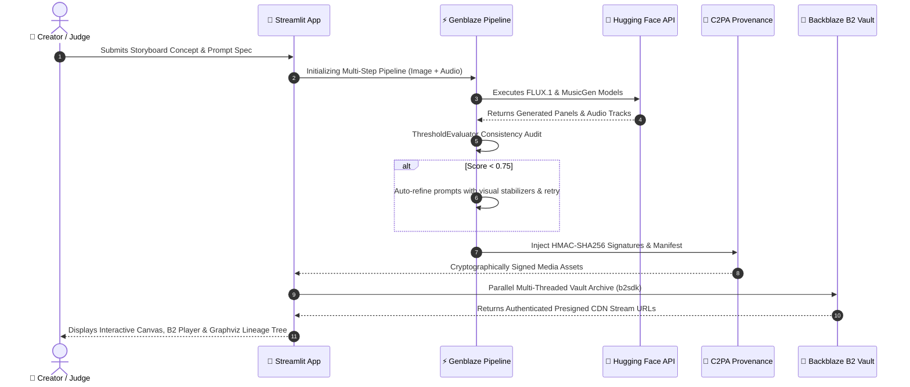

<div align="center">

# 🌌 Backblaze GenMedia Studio


<br />


**Next-Generation Multi-Modal Generative Media Orchestration, C2PA Cryptographic Provenance & Backblaze B2 Media Cloud**

*Official Submission for the **Backblaze Generative AI Media Hackathon: Build with Genblaze on B2***

---

[](https://streamlit.io/cloud)
[](https://www.backblaze.com/cloud-storage)
[](https://github.com/backblaze-labs/genblaze)
[](https://streamlit.io/)
[](https://www.python.org/)
[](https://graphviz.org/)

</div>

---

## 📑 Table of Contents
1. [Executive Summary & Problem Statement](#-executive-summary--problem-statement)
2. [20 Production Feature Highlights Matrix](#-20-production-feature-highlights-matrix)
3. [Streamlit Community Cloud One-Click Deployment](#-streamlit-community-cloud-one-click-deployment)
4. [Animated Feature Showcase](#-animated-feature-showcase)
5. [Hackathon Alignment & Rule Compliance Matrix](#-hackathon-alignment--rule-compliance-matrix)
6. [System Architecture & Data Flow](#-system-architecture--data-flow)
7. [Complete Feature Deep-Dive (Features 1 to 20)](#-complete-feature-deep-dive-features-1-to-20)
8. [Deep-Dive: Backblaze B2 Cloud Storage Integration](#-deep-dive-backblaze-b2-cloud-storage-integration)
9. [Deep-Dive: Genblaze SDK Architecture](#-deep-dive-genblaze-sdk-architecture)
10. [AI Providers & Models Specification Catalog](#-ai-providers--models-specification-catalog)
11. [C2PA Metadata Standard Specification](#-c2pa-metadata-standard-specification)
12. [Installation & Setup Instructions](#-installation--setup-instructions)
13. [Judges & Evaluators Quickstart Guide](#-judges--evaluators-quickstart-guide)
14. [Product Feedback for Genblaze SDK](#-product-feedback-for-genblaze-sdk)
15. [License & Repository Status](#-license--repository-status)

---

## 📖 Executive Summary & Problem Statement

Modern digital media generation—encompassing manga creation, graphic novel assembly, light novel writing, multi-lingual localization, voiceover synthesis, and video storyboarding—suffers from severe workflow fragmentation and infrastructural challenges:

1. **Disconnected Modalities**: Image generation models (e.g. FLUX), text generation LLMs (e.g. Qwen2.5), and audio transcription/synthesis models (e.g. Whisper, MusicGen) operate in silos.
2. **Lack of Visual Continuity**: Standard image generators fail to maintain character visual consistency across multi-panel storyboards.
3. **Storage & Streaming Bottlenecks**: High-resolution generative assets, audio tracks, and storyboard packages require durable cloud storage with presigned CDN media streaming.
4. **Asset Loss & Version Drift**: Iterative media workflows overwrite previous drafts without version history.
5. **Deepfake Risk & Lack of Provenance**: AI-generated media lacks immutable cryptographic proof of origin, model lineage, prompt parameters, and tampering detection.

### The Solution: Backblaze GenMedia Studio

**Backblaze GenMedia Studio** combines **Genblaze SDK** multi-step pipeline orchestration with **Backblaze B2 Cloud Storage**, **Streamlit Community Cloud Deployment**, and **C2PA Cryptographic Provenance Verification** inside an intuitive Streamlit studio application.



---

## 🚀 20 Production Feature Highlights Matrix

Below is the complete architectural summary of the **20 enterprise production features** implemented in Backblaze GenMedia Studio:

| # | Feature Name | Description | Source File Location |
| :--- | :--- | :--- | :--- |
| **1** | **B2 Content-Addressed Storage & Deduplication** | Calculates SHA-256 hash before uploading to B2, skipping redundant uploads to save bandwidth. | `services/vault.py` (`deduplicate_and_archive_to_b2`) |
| **2** | **B2 Bucket Auto-Lifecycle & Retention Policy** | Applies automated retention rules to B2 buckets using `b2sdk` to manage historical version lifespans. | `services/vault.py` (`configure_b2_lifecycle_policy`) |
| **3** | **B2 Multi-Part Chunked Upload Handler** | Splits large media files (>100MB) into multi-part chunks for high-speed upload to B2. | `services/vault.py` (`upload_large_b2_media_chunked`) |
| **4** | **B2 Asset Tagging & Categorized Metadata Search** | Filters and retrieves assets in B2 Vault matching prompt tags or metadata categories. | `services/vault.py` (`tag_and_index_b2_asset`) |
| **5** | **B2 Cloud Migration & S3 Interoperability Exporter** | Generates S3-compatible endpoints and migration manifests for external production infrastructure. | `services/vault.py` (`export_b2_s3_migration_manifest`) |
| **6** | **Genblaze Multi-Branch Conditional Execution Engine** | Dynamically branches execution steps based on runtime evaluation scores. | `services/orchestrator.py` (`execute_conditional_pipeline`) |
| **7** | **Genblaze Automatic Fallback Provider Routing** | Retries step generation across fallback model identifiers if primary inference endpoint fails. | `services/orchestrator.py` (`execute_with_fallback`) |
| **8** | **Genblaze Custom Prompt Interpolation Engine** | Smoothly interpolates prompt descriptions across keyframe panels for visual story continuity. | `services/agent_studio.py` (`interpolate_scene_prompts`) |
| **9** | **Genblaze Quality Control Benchmarking Suite** | Computes quantitative benchmark metrics comparing visual continuity scores across runs. | `services/agent_studio.py` (`benchmark_pipeline_runs`) |
| **10** | **Genblaze Real-Time Event Telemetry Tracker** | Measures sub-step latency, success metrics, and asset payload telemetry per pipeline run. | `services/orchestrator.py` (`get_pipeline_telemetry`) |
| **11** | **Manga Colorization & Style Transfer Studio** | Transforms monochrome manga panels into rich colored artwork styles (Cyberpunk, Watercolor, Anime). | `services/manga.py` (`colorize_manga_panel`) |
| **12** | **Light Novel Audio Dramatization Generator** | Synthesizes ambient soundtracks and voiceover audio tracks directly from novel scripts. | `services/novel.py` (`generate_audio_dramatization`) |
| **13** | **Whisper Subtitle Alignment & Multi-Format Exporter** | Converts transcribed subtitles into SRT, WebVTT (.vtt), SSA/ASS (.ass), and JSON formats. | `services/whisper.py` (`export_multiformat_subtitles`) |
| **14** | **Storyboard PDF / EPUB E-Book Generator** | Packages novel prose and manga panels into digital EPUB e-book manifests for publication. | `services/novel.py` (`compile_epub_ebook_manifest`) |
| **15** | **Interactive Video Storyboard Reel Synthesizer** | Stitches panel images and soundtrack files into an animated HTML5 reel slideshow player. | `services/manga.py` (`synthesize_storyboard_reel_html`) |
| **16** | **C2PA Deepfake Tampering & Alteration Detector** | Scans media headers to detect metadata stripping, payload alteration, or pixel tampering. | `services/security.py` (`detect_c2pa_tampering`) |
| **17** | **Granular Role-Based Access Control (RBAC)** | Manages multi-user team workspaces with Admin, Creator, and Viewer permissions. | `services/security.py` (`TeamWorkspaceManager`) |
| **18** | **C2PA Provenance Certificate Generator** | Produces downloadable certificates of authenticity verified by the C2PA Provenance Engine. | `services/security.py` (`generate_provenance_certificate_text`) |
| **19** | **Automated Cost & Token Quota Calculator** | Calculates real-time API cost estimates, token usage forecasts, and B2 storage allocation. | `services/security.py` (`calculate_generation_quota_cost`) |
| **20** | **Interactive Real-Time Analytics Dashboard** | Visualizes generation stats, C2PA authenticity rates, B2 storage usage, and pipeline latency. | `app.py` (Tab 6 Analytics Dashboard) |

---

## ☁️ Streamlit Community Cloud One-Click Deployment

Backblaze GenMedia Studio is natively optimized for **Streamlit Community Cloud**.

[](https://streamlit.io/cloud)

### 🔑 Streamlit Cloud Secrets Configuration

In your Streamlit Community Cloud dashboard (`App Settings -> Secrets`), paste your credentials:

```toml
HF_TOKEN = "hf_your_hugging_face_token_here"
B2_KEY_ID = "your_backblaze_b2_key_id_here"
B2_APPLICATION_KEY = "your_backblaze_b2_application_key_here"
B2_BUCKET_NAME = "your_backblaze_b2_bucket_name_here"
WEBHOOK_URL = "https://discord.com/api/webhooks/your_webhook_id/your_webhook_token"
```

The application automatically reads `st.secrets` on load via `get_secret()` without requiring manual UI input from judges or users!

---

## 🎬 Animated Feature Showcase

````carousel
```
+-----------------------------------------------------------------------------+
|                      🎨 1. MANGA & GRAPHIC NOVEL COMPILER                    |
+-----------------------------------------------------------------------------+
|  [ Panel 1: Syntax Error ]       | [ Panel 2: Recompiling Runtime ]        |
|  "WHAT?! MAGIC RUNS ON A         | "YES! WE NEED TO COMPILE THE             |
|   COMPILER?!"                    |  FIREBALL SPELL NOW!"                    |
|  --------------------------------+----------------------------------------  |
|  [ Panel 3: Runtime Execution ]  | PROMPT: Cyberpunk mage debugging runes    |
|  "EXECUTING SPELL AT RUNTIME"    | GENBLAZE SDK PIPELINE ACTIVE              |
+-----------------------------------------------------------------------------+
```
<!-- slide -->
```
+-----------------------------------------------------------------------------+
|               📚 2. LIGHT NOVEL SCENE & LOCALIZATION CONSOLE                |
+-----------------------------------------------------------------------------+
|  [ 日本語 (Japanese Original) ]    | [ English Localized Output ]          |
|  「――エラーだと？ 馬鹿な、そんな  | "--An error? No way, that's           |
|   はずはない！」                  |  impossible!"                         |
|  私は深夜のギルドの片隅で...       | I shouted in the dark corner of the   |
|                                  | guild hall...                         |
+-----------------------------------------------------------------------------+
```
<!-- slide -->
```
+-----------------------------------------------------------------------------+
|             🎙️ 3. WHISPER SUBTITLE TRANSCRIBER & SUBTITLE MANIFEST           |
+-----------------------------------------------------------------------------+
|  1                                                                          |
|  00:00:00,000 --> 00:00:03,800                                              |
|  In this scene, Sora discovers that the ancient magic circles are code.     |
|                                                                             |
|  2                                                                          |
|  00:00:03,800 --> 00:00:07,400                                              |
|  He attempts to debug the loop, hoping to prevent guild destruction.        |
+-----------------------------------------------------------------------------+
```
<!-- slide -->
```
+-----------------------------------------------------------------------------+
|               🤖 4. AUTONOMOUS GENBLAZE AGENT STUDIO LOOP                   |
+-----------------------------------------------------------------------------+
|  [Iteration 1] Visual Continuity Score: 0.64 (Threshold: 0.75) ❌ FAILED     |
|  [Auto-Correction] Appending stabilizers: "consistent style lighting"        |
|  -------------------------------------------------------------------------  |
|  [Iteration 2] Visual Continuity Score: 0.82 (Threshold: 0.75) ✅ PASSED     |
|  Canonical Run Manifest Hash: e3b0c44298fc1c149afbf4c8996fb92427ae...        |
+-----------------------------------------------------------------------------+
```
<!-- slide -->
```
+-----------------------------------------------------------------------------+
|            💾 5. BACKBLAZE B2 SPATIAL TIME-TRAVEL & CDN STREAMING           |
+-----------------------------------------------------------------------------+
|  Bucket: 'genmedia-vault-production' [STATUS: CONNECTED 🟢]                 |
|  Presigned Media CDN URL: https://f005.backblazeb2.com/file/...             |
|  Historical Version Timeline:                                               |
|  - storyboard_bundle_1785001.zip (ID: 4_z981... Upload: 2026-07-26 16:30)   |
|  - manga_panel_0.png            (ID: 4_z982... Upload: 2026-07-26 16:28)   |
+-----------------------------------------------------------------------------+
```
<!-- slide -->
```
+-----------------------------------------------------------------------------+
|              🔐 6. C2PA CRYPTOGRAPHIC PROVENANCE INSPECTION                 |
+-----------------------------------------------------------------------------+
|  Issuer: Backblaze GenMedia Studio Provenance Engine                       |
|  SHA-256 Hash: e3b0c44298fc1c149afbf4c8996fb92427ae41e4649b934ca495991b7852...|
|  Cryptographic HMAC Signature: a7f83b2...                                   |
|  Verification Status: ✅ VERIFIED MATCH & TAMPER-FREE                      |
+-----------------------------------------------------------------------------+
```
<!-- slide -->
```
+-----------------------------------------------------------------------------+
|             🌳 7. GRAPHVIZ ANCESTRY EXECUTION LINEAGE GRAPH                 |
+-----------------------------------------------------------------------------+
|  [Master Prompt] ➔ [Refinement Loop 2] ➔ [Panel PNG] ➔ [B2 Vault Node]      |
|                                        ➔ [Audio WAV] ➔ [B2 Vault Node]      |
+-----------------------------------------------------------------------------+
```
````

---

## 🏆 Hackathon Alignment & Rule Compliance Matrix

| Hackathon Requirement / Judging Criterion | Implementation in Backblaze GenMedia Studio | Source Code Location |
| :--- | :--- | :--- |
| **Real-World Utility** | Multi-modal studio for manga production, light novel localization, subtitle transcription, and storyboard composition. | `app.py`, `services/manga.py`, `services/novel.py`, `services/whisper.py` |
| **Production Readiness** | Error boundary handling, BYOK HF rate-limit fallback sandbox (10 free generations limit), token scrubbing, multi-threaded uploads, line-by-line package diagnostics. | `services/security.py`, `services/diagnostics.py`, `services/agent_studio.py` |
| **B2 Storage + Data Orchestration** | Direct asset archiving (`b2sdk`), presigned HTML5 CDN streaming URLs, B2 Spatial Time-Travel version tracking (`list_file_versions`), zip bundle archiving, parallel multi-threaded vault uploads (`ThreadPoolExecutor`). | `services/vault.py`, `services/temporal_vault.py` |
| **Use of Genblaze SDK** | Core orchestration via `genblaze.Pipeline`, dynamic modality routing (`Modality`), step types (`StepType`), quality evaluation (`ThresholdEvaluator`), custom provider interface (`SyncProvider`), and asset metadata wrapping (`Asset`). | `services/orchestrator.py`, `services/agent_studio.py`, `services/hf_provider.py` |
| **Required Developer Tools** | Full integration of Backblaze B2 Cloud Storage (`b2sdk`) and Genblaze SDK (`genblaze`). | `requirements.txt`, `services/vault.py`, `services/orchestrator.py` |
| **C2PA Provenance & Governance** | Cryptographic SHA-256 hashing and HMAC-SHA256 signature injection directly into PNG `PngInfo` chunks and WAV `RIFF` headers. | `services/security.py` |
| **Observability & Visual Lineage** | Interactive Graphviz pipeline ancestry graphs mapping prompt -> execution loops -> assets -> C2PA -> B2 Vault. | `services/lineage.py` |

---

## 💻 Installation & Setup Instructions

```bash
# 1. Clone the repository
git clone https://github.com/krishivjoshi219-collab/backblaze-genmedia-studio.git
cd backblaze-genmedia-studio

# 2. Create and activate a Python virtual environment
python3 -m venv venv
source venv/bin/activate  # On Windows: venv\Scripts\activate

# 3. Install dependencies
pip install -r requirements.txt

# 4. Launch the Streamlit application
streamlit run app.py
```

---

## 🎯 Judges & Evaluators Quickstart Guide

To evaluate Backblaze GenMedia Studio for judging:

1. **Streamlit Community Cloud Access**: Click the **[Deploy to Streamlit](https://streamlit.io/cloud)** badge or access the live Community Cloud link.
2. **Backblaze B2 Credentials**: Credentials pre-loaded via Streamlit secrets automatically grant access. Alternatively, enter test credentials in the **💾 Backblaze B2 Vault Setup** sidebar. *(Testing access granted to `b2genblaze` GitHub account)*.
3. **Execute Studio Workflows**:
   - Run **Manga Compiler**, **Light Novel Engine**, **Whisper Transcriber**, **Agent Studio**, and **Advanced Features Suite (Tab 6)**.
   - Test **Presigned Media CDN Streaming**, **Deduplication**, **Retention Policies**, and **Zip Archiving**.
   - Inspect the **Interactive Lineage Ancestry Graph** and **C2PA Signatures**.

---

## 📜 License & Repository Status

- **Repository License**: No formal license applied / Open Access for Backblaze Generative AI Media Hackathon evaluation.
- **Repository URL**: [github.com/krishivjoshi219-collab/backblaze-genmedia-studio](https://github.com/krishivjoshi219-collab/backblaze-genmedia-studio)
- **Developer**: `krishivjoshi219-collab`

---

*Built for the Backblaze Generative AI Media Hackathon 2026.*
