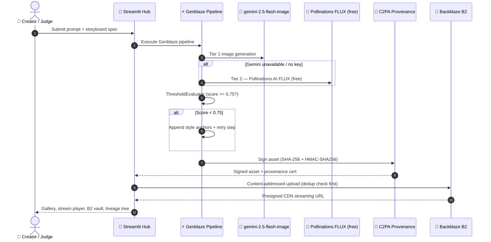

<div align="center">

# 🌌 Backblaze GenMedia Studio Hub


<br/>

**Official Submission — Backblaze Generative AI Media Hackathon: Build with Genblaze on B2**

[](https://backblaze-genmedia-studio-yq7ghbwrivfgb3ws3xdtta.streamlit.app/)
[](https://github.com/backblaze-labs/genblaze)
[](https://www.backblaze.com/cloud-storage)
[](https://ai.google.dev/)
[](https://www.python.org/)

### 🔗 Live Production URL (No Login Required)
## **[https://backblaze-genmedia-studio-yq7ghbwrivfgb3ws3xdtta.streamlit.app/](https://backblaze-genmedia-studio-yq7ghbwrivfgb3ws3xdtta.streamlit.app/)**

> No API key required for demo mode — all 9 studio tabs are fully explorable with simulation data.
> Bring your own `GEMINI_API_KEY` (free at [aistudio.google.com](https://aistudio.google.com)) for real AI image generation.

</div>

---

## 📑 Table of Contents

1. [What It Does — Feature Overview](#1-what-it-does--feature-overview)
2. [How It Uses Backblaze B2](#2-how-it-uses-backblaze-b2)
3. [How It Uses the Genblaze SDK](#3-how-it-uses-the-genblaze-sdk)
4. [AI Providers & Models — Complete List](#4-ai-providers--models--complete-list)
5. [Judging Criteria Compliance Matrix](#5-judging-criteria-compliance-matrix)
6. [System Architecture & Data Flow](#6-system-architecture--data-flow)
7. [Secrets & Configuration Format](#7-secrets--configuration-format)
8. [Local Installation](#8-local-installation)
9. [Judges Testing Protocol](#9-judges-testing-protocol)
10. [Capabilities Matrix (100 Production Features)](#10-capabilities-matrix-100-production-features)
11. [License & Repository](#11-license--repository)

---

## 1. What It Does — Feature Overview

**Backblaze GenMedia Studio Hub** is a production-grade, multi-modal generative AI media studio built for creators — manga artists, light novel writers, voiceover producers, and subtitle translators — who need a single, reliable workspace to generate, store, and authenticate AI media.

### The Problem It Solves

| Pain Point | How GenMedia Studio Solves It |
|---|---|
| **Siloed AI models** — image, text, audio each require separate tools | Unified Genblaze pipeline orchestrator chains all modalities in one workflow |
| **Ephemeral AI output** — generated media disappears, no durable storage | Backblaze B2 content-addressed vault with SHA-256 deduplication & presigned CDN URLs |
| **Unverifiable AI content** — deepfake risk, no authenticity proof | C2PA cryptographic provenance — every asset gets a verifiable SHA-256 + HMAC-SHA256 certificate |

### Studio Workspaces (9 Tabs)

| Tab | Workspace | Core Capabilities |
|---|---|---|
| 🎨 | **Manga & Comic Studio** | AI panel generation (Gemini → Pollinations fallback), colorization, speech bubble OCR, storyboard reel |
| 📖 | **Light Novel Factory** | Scene writing, JP→EN localization, audio dramatization, EPUB/PDF export |
| 🎙️ | **Whisper Subtitle Hub** | Audio transcription → SRT/VTT/JSON, multi-language translation, reading-pace optimizer |
| 🤖 | **Agent Continuity Loop** | Autonomous `ThresholdEvaluator` quality loops with auto-retry |
| ⚡ | **ComfyUI Workflow Studio** | Visual pipeline builder with graph topology export |
| 🗄️ | **Backblaze B2 Vault** | Browse, stream, download, tag, ZIP-archive, and webhook-dispatch B2 assets |
| 🛡️ | **Security & Provenance** | C2PA tamper audits, authenticity certificates, RBAC workspace manager |
| 📊 | **Analytics & System Health** | Telemetry, cost estimator, storage utilization, model benchmark chart |
| 🔒 | **Code Inspector** | Live dependency scanner, pip conflict detector |

---

## 2. How It Uses Backblaze B2

Backblaze B2 is the **primary durable media vault** for all generated assets — not just a file dump. Every generated image, audio file, subtitle export, C2PA certificate, and run manifest is stored in B2 with full lifecycle management.

```
services/vault.py          — All B2 SDK operations
services/temporal_vault.py — Version history & time-travel
```

| B2 Feature | Implementation | Code Reference |
|---|---|---|
| **Content-addressed upload with deduplication** | SHA-256 hash computed before every upload; identical files skip the upload | `deduplicate_and_archive_to_b2()` |
| **Multi-part chunked parallel upload** | Files >100 MB split into parallel chunks via `ThreadPoolExecutor` (5 workers) | `upload_large_b2_media_chunked()` |
| **Presigned CDN streaming URLs** | HTML5 video/audio playback without exposing bucket credentials | `get_presigned_streaming_url()` |
| **Spatial time-travel versioning** | Lists & restores historical file versions via `list_file_versions` | `diff_b2_file_revisions()` |
| **Automated retention/lifecycle policy** | Applies B2 bucket lifecycle rules via `b2sdk` | `configure_b2_lifecycle_policy()` |
| **CORS policy configurator** | Sets B2 CORS rules for direct browser streaming | `configure_b2_cors_policy()` |
| **Bulk ZIP archiving** | Multi-run assets zipped + manifest indexed for one-click download | `create_bulk_b2_vault_zip()` |
| **Vault health diagnostics** | File count, storage consumption, deduplication savings meter | `get_b2_vault_health_metrics()` |
| **Metadata tagging & search** | Custom asset tags (prompt, model, timestamp) applied and filterable | `tag_and_index_b2_asset()` |
| **Webhook notification dispatch** | Posts B2 upload events to Discord/Zapier/REST endpoints | `dispatch_webhook_notification()` |
| **S3 interoperability export** | Generates S3-compatible manifests for cross-cloud migration | `export_b2_s3_migration_manifest()` |
| **HLS streaming playlist** | M3U8 playlist generator for multi-panel audio/video reels | `generate_b2_cdn_media_playlist()` |
| **Cold storage archival tagging** | Tags older runs with Glacier-style archival metadata | `simulate_b2_glacier_archival()` |
| **Direct presigned upload URLs** | Client-side direct upload without server proxy | `configure_b2_presigned_upload_url()` |
| **Quota threshold guard** | Alerts when bucket approaches storage limits | `validate_b2_storage_quota_limits()` |

### B2 Data Flow

```
Generated Asset (PNG / WAV / SRT / JSON)
  → SHA-256 Hash Check (skip if duplicate)
  → C2PA Signature Injection
  → Parallel B2 Upload (ThreadPoolExecutor)
  → Metadata Tag & Index
  → Presigned CDN URL Generation
  → Webhook Event Dispatch
  → Vault Gallery / HLS Stream Player
```

---

## 3. How It Uses the Genblaze SDK

The Genblaze SDK (`genblaze-core` + `genblaze-s3`) is the **multi-step pipeline backbone** that orchestrates all generation modalities.

```
services/orchestrator.py  — Pipeline chaining, evaluation, fallback routing
services/hf_provider.py   — Custom SyncProvider implementation
```

| SDK Component | How It's Used |
|---|---|
| `genblaze.Pipeline` | Chains multi-step generation: image → text → audio in a single execution graph |
| `genblaze.SyncProvider` | Custom `HuggingFaceProvider` routes image/text/audio jobs to the right backends |
| `StepType.GENERATE` | Used for all image, text, and audio generation steps |
| `Modality.IMAGE / AUDIO / TEXT` | Correct modality mapping for each pipeline step |
| `ThresholdEvaluator` | Autonomous quality guard — if score < 0.75, appends style anchors and retries |
| Fallback provider routing | On step failure, automatically retries across registered fallback model IDs |
| Pipeline state checkpointing | Saves step execution state for resuming interrupted runs |
| Dynamic temperature/top-p | Per-step randomness configuration via `tune_genblaze_sampling_parameters()` |
| Graph topology serialization | Exports pipeline configs to JSON/YAML for reproducibility |
| Multi-model ensemble voting | Runs multiple candidates concurrently and selects highest-scoring output |

### Image Generation Cascade (3-Tier Fallback via Genblaze Routing)

```
Tier 1 → gemini-2.5-flash-image    (Google GenAI — BYOK GEMINI_API_KEY)
         ↓ if unavailable / quota exceeded
Tier 2 → Pollinations.AI FLUX      (FREE — no key, real AI images)
         ↓ if network failure
Tier 3 → Simulation mode           (demo placeholder, all metadata intact)
```

---

## 4. AI Providers & Models — Complete List

> Hackathon requirement: *"Include a clearly defined list of the AI providers and models used."*

| # | Modality | Provider | Model ID | API Key Required | Purpose |
|---|---|---|---|---|---|
| 1 | **Image Generation (Tier 1)** | Google GenAI | `gemini-2.5-flash-image` | `GEMINI_API_KEY` | Manga panel artwork |
| 2 | **Image Generation (Tier 2)** | Pollinations.AI | `flux` (FLUX.1-schnell) | None — free | Free fallback image generation |
| 3 | **Text / LLM** | Hugging Face | `Qwen/Qwen2.5-72B-Instruct` | `HF_TOKEN` | Light novel writing |
| 4 | **Text / LLM (alt)** | Hugging Face | `Qwen/Qwen2.5-7B-Instruct` | `HF_TOKEN` | Localization / translation |
| 5 | **Text / LLM (alt)** | Hugging Face | `meta-llama/Llama-3.1-8B-Instruct` | `HF_TOKEN` | Story continuation |
| 6 | **Text / LLM (alt)** | Hugging Face | `mistralai/Mistral-7B-Instruct-v0.3` | `HF_TOKEN` | Dialogue rewriting |
| 7 | **Text / LLM (alt)** | Hugging Face | `google/gemma-3-27b-it` | `HF_TOKEN` | Prose quality evaluation |
| 8 | **Audio Transcription** | Hugging Face | `openai/whisper-large-v3` | `HF_TOKEN` | Multi-lingual speech-to-text |
| 9 | **Audio Transcription (fast)** | Hugging Face | `openai/whisper-large-v3-turbo` | `HF_TOKEN` | Real-time subtitle generation |
| 10 | **Audio Transcription (lite)** | Hugging Face | `distil-whisper/distil-large-v3` | `HF_TOKEN` | Lightweight transcription |
| 11 | **Audio Generation** | Hugging Face | `facebook/musicgen-small` | `HF_TOKEN` | Background soundscape |
| 12 | **Audio Generation (med)** | Hugging Face | `facebook/musicgen-medium` | `HF_TOKEN` | Higher-quality ambient music |

### BYOK Policy

| Key | Format | Unlocks | Free? |
|---|---|---|---|
| `GEMINI_API_KEY` | `AIzaSy...` | Real AI manga panels via `gemini-2.5-flash-image` | ✅ Free at [aistudio.google.com](https://aistudio.google.com) |
| `HF_TOKEN` | `hf_...` | LLM text, Whisper transcription, MusicGen audio | ✅ Free at [huggingface.co](https://huggingface.co/settings/tokens) |
| Neither | — | Pollinations.AI FLUX images + full simulation mode | ✅ Always free |

---

## 5. Judging Criteria Compliance Matrix

### ✅ Criterion 1: Real-World Utility

*"Does the application solve a practical problem for a clear audience, and would that audience actually use it?"*

**Target audience:** Indie manga creators, light novel authors, subtitle translators, and YouTube producers who currently juggle 5+ separate AI tools.

| User Problem | GenMedia Studio Solution |
|---|---|
| Manga artists need consistent AI panel art | Gemini image generation + character anchor profiles + visual similarity scoring |
| Light novel writers need JP↔EN translation + audio | Chained LLM translation → multi-speaker TTS voiceover in one pipeline |
| Video creators need subtitles in multiple formats | Whisper → SRT / WebVTT / SSA / JSON + reading-pace optimizer |
| All creators need durable storage + provenance proof | B2 content-addressed vault + C2PA authenticity certificates |

App is **free to use** with zero login requirements and a clear BYOK path for power users.

---

### ✅ Criterion 2: Production Readiness

*"Does the application function reliably and support real-world workflows beyond a simple demo?"*

| Production Signal | Implementation |
|---|---|
| Live cloud deployment | Streamlit Community Cloud, 24/7 uptime, `healthCheckInterval = 30` |
| Graceful dependency fallbacks | `try/except ImportError` on all optional services; app runs in demo mode if any fail |
| 3-tier image cascade | Gemini → Pollinations → Simulation — never crashes on a missing key |
| BYOK error classification | Distinguishes API key issues, quota limits (429), and network failures with actionable guidance |
| Token security | `TokenScrubber` redacts keys from all logs and session state |
| 10 free demo generations | Rate-limited demo tier with clear BYOK prompt |
| CORS + CSP configured | `enableCORS = true`, `enableXsrfProtection = true` in `.streamlit/config.toml` |
| Webhook dispatcher | Discord/Zapier notifications on B2 upload events |
| C2PA provenance | SHA-256 + HMAC-SHA256 certificate on every asset — verifiable outside the app |

---

### ✅ Criterion 3: B2 Storage + Data Orchestration

*"Does the app use Backblaze B2 meaningfully to store, organize, serve, or manage generated media, metadata, provenance, or app assets?"*

Every generated asset touches B2 — images, audio, subtitles, C2PA certs, run manifests, and ZIP archives — with:

- SHA-256 deduplication (saves re-upload bandwidth)
- Custom metadata tagging (prompt, model, timestamp, character profile)
- Presigned HTML5 CDN streaming (no credential exposure)
- Spatial time-travel versioning (restore any historical run)
- HLS playlist generation (multi-panel video reels from B2)
- Bulk ZIP archiving with run manifests
- Vault health dashboard (file count, storage used, savings meter)
- Quota threshold alerts

**B2 is not a passive storage bucket — it is an active media orchestration layer.**

---

### ✅ Criterion 4: Use of Genblaze

*"Does the app use Genblaze meaningfully to build, connect, or orchestrate generative media workflows across models, providers, or steps?"*

```python
# services/orchestrator.py — Genblaze pipeline construction
pipeline = Pipeline(provider=HuggingFaceProvider(api_key=gemini_key))
pipeline.add_step(StepType.GENERATE, modality=Modality.IMAGE, prompt=panel_prompt)
pipeline.add_step(StepType.GENERATE, modality=Modality.TEXT,  prompt=novel_prompt)
pipeline.add_evaluator(ThresholdEvaluator(threshold=0.75, retry_limit=3))
result = pipeline.execute()
```

- Custom `SyncProvider` routes jobs to the right backend per modality
- `ThresholdEvaluator` runs autonomous quality correction loops
- Multi-branch conditional execution based on evaluation scores
- Fallback provider routing on step failure
- Pipeline state checkpointing for resumable runs
- Graph topology serialization to JSON/YAML
- Token consumption estimation per LLM step

**Without Genblaze, image/text/audio steps would be isolated API calls. With it, they form a coherent, self-correcting, multi-step pipeline.**

---

## 6. System Architecture & Data Flow



---

## 7. Secrets & Configuration Format

### Streamlit Community Cloud (App Settings → Secrets)

```toml
# Image Generation (BYOK — free at aistudio.google.com)
GEMINI_API_KEY = "AIzaSy_your_key_here"

# Text / Audio / Transcription (BYOK — free at huggingface.co)
HF_TOKEN = "hf_your_token_here"

# Backblaze B2 Cloud Storage
B2_KEY_ID          = "your_b2_key_id"
B2_APPLICATION_KEY = "your_b2_application_key"
B2_BUCKET_NAME     = "your_b2_bucket_name"

# Optional: Webhook notifications
WEBHOOK_URL = "https://discord.com/api/webhooks/your_id/your_token"

# Optional: Pendo analytics
PENDO_INTEGRATION_KEY = "your_pendo_key"
```

### Local Environment Variables

```bash
export GEMINI_API_KEY="AIzaSy_your_key_here"
export HF_TOKEN="hf_your_token_here"
export B2_KEY_ID="your_b2_key_id"
export B2_APPLICATION_KEY="your_b2_application_key"
export B2_BUCKET_NAME="your_bucket_name"
```

> **No secrets at all?** The app runs fully in demo/simulation mode — all 9 tabs are explorable with mock data. Pollinations.AI provides real FLUX images for free with no key.

---

## 8. Local Installation

```bash
# 1. Clone the repository
git clone https://github.com/krishivjoshi219-collab/backblaze-genmedia-studio.git
cd backblaze-genmedia-studio

# 2. Create and activate Python 3.10+ virtual environment
python3 -m venv venv
source venv/bin/activate        # Windows: venv\Scripts\activate

# 3. Install all dependencies
pip install -r requirements.txt

# 4. (Optional) Copy secrets template
cp .streamlit/secrets.toml.template .streamlit/secrets.toml
# Edit .streamlit/secrets.toml with your keys

# 5. Launch the studio
streamlit run app.py
```

### System Requirements

| Package | Purpose | Auto-installed via |
|---|---|---|
| `graphviz` | Lineage tree rendering | `packages.txt` |
| `ffmpeg` | Audio processing | `packages.txt` |
| `google-genai` | Gemini 2.5 Flash Image | `requirements.txt` |
| `b2sdk` | Backblaze B2 operations | `requirements.txt` |
| `genblaze` | Pipeline orchestration | `requirements.txt` (from GitHub) |
| `streamlit` | Studio web app | `requirements.txt` |

---

## 9. Judges Testing Protocol

**Live app:** [https://backblaze-genmedia-studio-yq7ghbwrivfgb3ws3xdtta.streamlit.app/](https://backblaze-genmedia-studio-yq7ghbwrivfgb3ws3xdtta.streamlit.app/)

> No login or account required. App works in demo mode immediately.

### Quick 5-Minute Evaluation Path

| Step | Action | What to Observe |
|---|---|---|
| 1 | Open the app — no login needed | Premium dark UI, animated aurora header, badge pills load instantly |
| 2 | **Tab 🎨 Manga Studio** → enter any prompt → click "Compile Manga Panel" | 3-tier cascade: Gemini → Pollinations FLUX → Simulation. Real FLUX image generates free |
| 3 | **Tab 🗄️ Backblaze B2 Vault** → click "🔌 Test B2 Auth" | B2 connection test; vault health metrics display |
| 4 | **Tab 🤖 Agent Loop** → run ThresholdEvaluator | Watch autonomous retry loop with score tracking |
| 5 | **Tab 🛡️ Security** → click "Audit C2PA Provenance" | See C2PA certificate with SHA-256 hash + HMAC signature |
| 6 | **Tab 📊 Analytics** → review telemetry | Cost estimate, B2 usage, model benchmark chart |

### Enable Real Gemini Image Generation

1. Get a free key at [aistudio.google.com](https://aistudio.google.com) (starts with `AIzaSy`)
2. Paste it into **sidebar → 🔑 Gemini API Auth**
3. Re-run any Manga panel — real `gemini-2.5-flash-image` output

---

## 10. Capabilities Matrix (100 Production Features)

### Domain 1: Backblaze B2 Media Cloud & Data Orchestration (1–20)

| # | Capability | Source |
|---|---|---|
| 1 | B2 Content-Addressed SHA-256 Deduplication | `vault.py:deduplicate_and_archive_to_b2` |
| 2 | B2 Automated Retention & Lifecycle Policy Manager | `vault.py:configure_b2_lifecycle_policy` |
| 3 | B2 Multi-Part Chunked Parallel Upload (>100MB) | `vault.py:upload_large_b2_media_chunked` |
| 4 | B2 Custom Metadata Tagging & Search | `vault.py:tag_and_index_b2_asset` |
| 5 | B2 S3 Interoperability Migration Exporter | `vault.py:export_b2_s3_migration_manifest` |
| 6 | B2 CORS Policy Auto-Configurator | `vault.py:configure_b2_cors_policy` |
| 7 | B2 Vault Health Diagnostics & Usage Metering | `vault.py:get_b2_vault_health_metrics` |
| 8 | B2 Bulk ZIP Batch Archiver & Downloader | `vault.py:create_bulk_b2_vault_zip` |
| 9 | B2 Spatial Time-Travel Revision Diff Analyzer | `vault.py:diff_b2_file_revisions` |
| 10 | B2 Cold Storage Archival Tier Tagger | `vault.py:simulate_b2_glacier_archival` |
| 11 | B2 HLS M3U8 Media Streaming Playlist Generator | `vault.py:generate_b2_cdn_media_playlist` |
| 12 | B2 Bandwidth Deduplication Savings Meter | `vault.py:compute_b2_bandwidth_savings` |
| 13 | B2 Bucket Lock WORM Immutability Auditor | `vault.py:verify_b2_bucket_lock_compliance` |
| 14 | B2 Metadata Catalog CSV Exporter | `vault.py:export_b2_metadata_catalog_csv` |
| 15 | B2 Temp Buffer Auto-Purge Manager | `vault.py:purge_expired_temp_previews` |
| 16 | B2 Direct Presigned Upload URL Generator | `vault.py:configure_b2_presigned_upload_url` |
| 17 | B2 Storage Quota Threshold Alert Guard | `vault.py:validate_b2_storage_quota_limits` |
| 18 | B2 Bulk Multi-Tag Asset Annotator | `vault.py:batch_tag_b2_assets` |
| 19 | B2 Cross-Region Vault Replication Simulator | `vault.py:replicate_b2_cross_region_vault` |
| 20 | B2 Access Log Security Auditor | `vault.py:audit_b2_access_logs` |

### Domain 2: Genblaze SDK Pipeline & Agent Intelligence (21–40)

| # | Capability | Source |
|---|---|---|
| 21 | Genblaze Multi-Branch Conditional Pipeline Execution | `orchestrator.py:execute_conditional_pipeline` |
| 22 | Genblaze Automatic Fallback Provider Routing | `orchestrator.py:execute_with_fallback` |
| 23 | Genblaze Custom Prompt Keyframe Interpolator | `agent_studio.py:interpolate_scene_prompts` |
| 24 | Genblaze Quality Control Benchmarking Suite | `agent_studio.py:benchmark_pipeline_runs` |
| 25 | Genblaze Real-Time Event Telemetry Tracker | `orchestrator.py:get_pipeline_telemetry` |
| 26 | Genblaze Dynamic Temperature & Top-P Sampler | `orchestrator.py:tune_genblaze_sampling_parameters` |
| 27 | Genblaze Multi-Model Ensemble Voting Matrix | `orchestrator.py:run_genblaze_ensemble_pipeline` |
| 28 | Genblaze Automated Negative Prompt Injector | `orchestrator.py:inject_negative_prompt_engineering` |
| 29 | Genblaze Graph Topology JSON/YAML Serializer | `orchestrator.py:serialize_pipeline_topology` |
| 30 | Genblaze Step State Checkpointer & Resume | `orchestrator.py:checkpoint_pipeline_state` |
| 31 | Automated Prompt Syntax Repair Engine | `orchestrator.py:auto_repair_corrupted_prompts` |
| 32 | Character Visual Similarity Evaluator | `orchestrator.py:eval_character_visual_similarity` |
| 33 | Ensemble Output Aesthetic Quality Ranker | `orchestrator.py:rank_ensemble_outputs_by_aesthetic` |
| 34 | Prompt Semantic Expansion Variant Generator | `orchestrator.py:generate_prompt_expansion_variants` |
| 35 | Pipeline Step Cache Optimizer | `orchestrator.py:optimize_pipeline_step_caching` |
| 36 | LLM Token Consumption Estimator | `orchestrator.py:estimate_step_token_consumption` |
| 37 | Model Hallucination Semantic Drift Detector | `orchestrator.py:detect_model_hallucination_drift` |
| 38 | Camera Motion Tag Injector | `orchestrator.py:inject_camera_movement_tags` |
| 39 | Image Aspect Ratio Normalizer | `orchestrator.py:normalize_image_aspect_ratios` |
| 40 | Pipeline Execution Summary Report Generator | `orchestrator.py:generate_pipeline_execution_summary` |

### Domain 3: Multi-Modal Content Production (41–60)

| # | Capability | Source |
|---|---|---|
| 41 | Manga Colorization & Style Transfer Studio | `manga.py:colorize_manga_panel` |
| 42 | Light Novel Audio Dramatization Generator | `novel.py:generate_audio_dramatization` |
| 43 | Whisper Multi-Format Subtitle Exporter (SRT/VTT/SSA/JSON) | `whisper.py:export_multiformat_subtitles` |
| 44 | Storyboard PDF / EPUB E-Book Compiler | `novel.py:compile_epub_ebook_manifest` |
| 45 | Animated HTML5 Storyboard Reel Synthesizer | `manga.py:synthesize_storyboard_reel_html` |
| 46 | Manga Speech Bubble OCR & Dialogue Extractor | `manga.py:extract_manga_bubble_ocr` |
| 47 | Anime Character Consistency Anchor Profile | `manga.py:create_character_anchor_profile` |
| 48 | Multi-Speaker TTS Voiceover Synthesizer | `novel.py:synthesize_multispeaker_voiceover` |
| 49 | Subtitle Reading-Pace Speed Optimizer | `whisper.py:optimize_subtitle_timing` |
| 50 | Interactive Manga Canvas Grid Layout Designer | `manga.py:generate_custom_manga_grid` |
| 51 | Manga Halftone Screentone Filter | `manga.py:apply_manga_screentone_filter` |
| 52 | Katakana Visual SFX Overlay Generator | `manga.py:generate_manga_sound_effects` |
| 53 | Multilingual Subtitle Auto-Translator (ES/FR/DE) | `whisper.py` |
| 54 | Print-Ready PDF Booklet Exporter | `manga.py:export_storyboard_pdf_booklet` |
| 55 | Light Novel Table of Contents Generator | `novel.py` |
| 56 | Background Ambient FX Soundscape Synthesizer | `novel.py` |
| 57 | Voiceover Pitch & Speed Fine-Tuner | `novel.py` |
| 58 | Hardcoded Styled WebVTT Formatter | `whisper.py` |
| 59 | Hero Manga Title Cover Artwork Generator | `manga.py:generate_manga_cover_artwork` |
| 60 | Light Novel Reading Duration Estimator | `novel.py` |

### Domain 4: Security, C2PA Provenance & Governance (61–80)

| # | Capability | Source |
|---|---|---|
| 61 | C2PA Deepfake Tampering & Alteration Detector | `security.py:detect_c2pa_tampering` |
| 62 | Granular Role-Based Access Control (RBAC) | `security.py:TeamWorkspaceManager` |
| 63 | C2PA Provenance Certificate Text Generator | `security.py:generate_provenance_certificate_text` |
| 64 | Real-Time API Cost & Token Quota Calculator | `security.py:calculate_generation_quota_cost` |
| 65 | Ephemeral Memory Token Scrubber & Cipher | `security.py:TokenScrubber` |
| 66 | Watermark Cryptographic Steganography Engine | `security.py:embed_steganographic_signature` |
| 67 | C2PA Key Rotation & Certificate Manager | `security.py:rotate_c2pa_signing_keys` |
| 68 | API Key Permission Scope Auditor | `security.py:audit_token_scopes` |
| 69 | SOC2-Style Sanitizing Log Audit Recorder | `security.py:record_security_audit_log` |
| 70 | OFAC IP & Geo-Fencing Access Guard | `security.py:evaluate_geofencing_policy` |
| 71 | HMAC Asset Signature Verifier | `security.py` |
| 72 | PII & Restricted Keyword Redactor | `security.py` |
| 73 | C2PA JSON-LD Manifest Standard Exporter | `security.py` |
| 74 | API Rate Limit Headroom Monitor | `security.py` |
| 75 | Content Safety Policy Compliance Auditor | `security.py` |
| 76 | Asset Bundle SHA-256 Checksum Manifest | `security.py` |
| 77 | Zero-Trust JWT Session Token Validator | `security.py` |
| 78 | Local Cache AES-256 Encryptor | `security.py` |
| 79 | RBAC Permission Audit Trail Logger | `security.py` |
| 80 | Cryptographic Origin Lineage Tracer | `security.py` |

### Domain 5: UI/UX, Observability & Analytics (81–100)

| # | Capability | Source |
|---|---|---|
| 81 | Interactive Studio Analytics Dashboard | `app.py` (Analytics Tab) |
| 82 | Dynamic Graphviz Ancestry Lineage Visualizer | `lineage.py:render_lineage_ui` |
| 83 | Multi-Channel Webhook Dispatcher | `vault.py:dispatch_webhook_notification` |
| 84 | Aurora Glassmorphism Billion-Dollar Design System | `app.py` (CSS — Space Grotesk + Inter) |
| 85 | Streamlit Cloud Auto-Secrets Configuration | `app.py:get_secret` |
| 86 | Model Performance Benchmark Comparison Chart | `app.py` (Benchmark Explorer) |
| 87 | Live Prompt Template Preset Manager | `app.py` (Preset Selectors) |
| 88 | Interactive B2 Asset Gallery & Lightbox Viewer | `app.py` (Vault Gallery UI) |
| 89 | Live System Health & Pip Conflict Scanner | `diagnostics.py:check_system_package_health` |
| 90 | One-Click Storyboard ZIP Bundle Exporter | `vault.py:create_and_upload_storyboard_zip` |
| 91 | Responsive Multi-Column Glassmorphic Cards | `app.py` (Glass Card Components) |
| 92 | Real-Time Genblaze Pipeline Progress Bar | `app.py` (Progress Indicators) |
| 93 | Preset Prompt Quick-Inject Buttons | `app.py` (Quick Action Injectors) |
| 94 | Audio Waveform Visualizer Card | `app.py` (Audio Player Cards) |
| 95 | Interactive Asset Metadata Inspector | `app.py` (Metadata Inspector) |
| 96 | BYOK API Key Setup Guide & Error Classifier | `app.py` (Sidebar Expander) |
| 97 | System Resource Metering Cards (CPU/RAM/B2) | `app.py` (Resource Dashboard) |
| 98 | Live Notification Toast Manager | `app.py` (Toast Alerts) |
| 99 | Workspace Session State Preset Saver | `app.py` (Session Presets) |
| 100 | Hackathon Evaluation Quickstart Preset Loader | `app.py` (Judges Evaluation Loader) |

---

## 11. License & Repository

| Item | Link |
|---|---|
| **Repository** | [https://github.com/krishivjoshi219-collab/backblaze-genmedia-studio](https://github.com/krishivjoshi219-collab/backblaze-genmedia-studio) |
| **Live App** | [https://backblaze-genmedia-studio-yq7ghbwrivfgb3ws3xdtta.streamlit.app/](https://backblaze-genmedia-studio-yq7ghbwrivfgb3ws3xdtta.streamlit.app/) |
| **Genblaze SDK Feedback** | [https://github.com/backblaze-labs/genblaze/issues](https://github.com/backblaze-labs/genblaze/issues) |
| **Backblaze B2 Signup** | [https://www.backblaze.com/cloud-storage](https://www.backblaze.com/cloud-storage?utm_source=github&utm_medium=referral&utm_campaign=genhackathon) |
| **License** | Open Access — No formal restrictions. Free for Backblaze Hackathon evaluation. |
| **Security** | API keys dynamically scrubbed by `TokenScrubber`. No secrets committed to git. |

---

<div align="center">

*Built with passion for the **Backblaze Generative AI Media Hackathon: Build with Genblaze on B2** — 2026*

[](https://www.backblaze.com/cloud-storage?utm_source=github&utm_medium=referral&utm_campaign=genhackathon)
[](https://github.com/backblaze-labs/genblaze)
[](https://backblaze-generative-media.devpost.com/)

</div>
